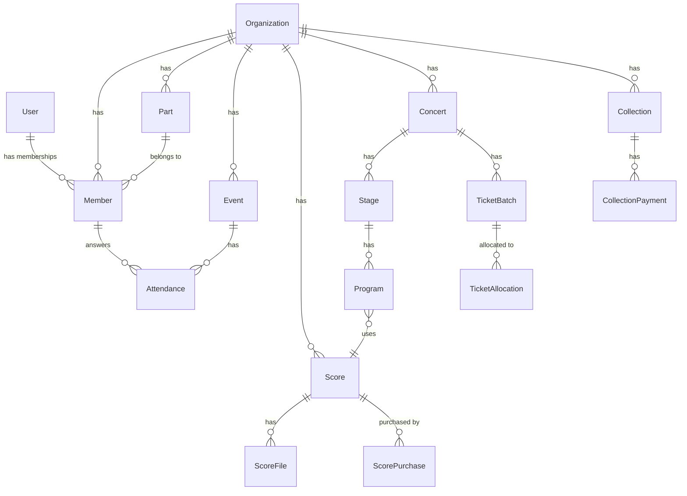

# ChoirHub

> 合唱団の運営業務をひとつの SaaS で完結させる、マルチテナント型の合唱団向け運営支援 Web アプリ


---

## 概要

合唱団の運営は「スケジュールは伝助、楽譜はメール添付、連絡はメーリングリスト、チケット集計は Excel…」と複数ツールが乱立しがちです。**ChoirHub** はこれらをひとつのプラットフォームに統合し、運営担当者の管理コストを削減します。

1 人のユーザーが複数の合唱団に所属できる **マルチテナント設計** を採用しており、ロール名・パート構成をカスタマイズすることで男声・混声・女声・学生合唱など幅広い団体形態に対応できます。

---

## 解決する課題

| 課題 | 現状 | ChoirHub での解決 |
| ------ | ------ | ----------------- |
| スケジュール・出欠管理 | 伝助など外部ツール依存 | 統合出欠カレンダー（伝助ビュー） |
| 楽譜の配布・管理 | メール添付・紙配布 | クラウド楽譜管理 + 権限制御 |
| 本番出演調査 | Google フォーム等の使い捨て | オンステ調査 → 確定フロー |
| 団内連絡・アーカイブ | メーリングリスト（履歴が消える） | 送受信履歴の一元管理 |
| チケット販売管理 | Excel スプレッドシート | チケット配布・集計 + パートレース |
| 会計・費用管理 | 手作業の帳簿 | 支出・徴収の一元管理 |

---

## 主要機能

| モジュール | 機能概要 |
| ----------- | --------- |
| **ホーム** | 直近イベント・未回答出欠・最新メールをダッシュボード表示 |
| **メンバー管理** | 招待メールによる入団フロー・プロフィール・顔写真管理 |
| **スケジュール・出欠** | 月カレンダー + 伝助ビュー（縦軸: メンバー / ○△✕回答） |
| **楽譜・MIDI 管理** | PDF/MIDI アップロード・アクセスレベル制御・購入記録管理 |
| **本番・オンステ管理** | 演奏会 → ステージ → 演目の階層管理・オンステ調査フロー |
| **メーリス管理** | 宛先絞り込み送信・テンプレート・履歴の永続アーカイブ |
| **チケット管理** | 席種別配布・自己入力・集計・パートセールスレース |
| **会計・費用管理** | 支出登録・場所代徴収・月次収支サマリー |
| **設定** | パート・ロール表示名・会費方式のカスタマイズ |

---

## 技術スタック

### フレームワーク・言語

| 技術 | バージョン | 用途 |
| ------ | ----------- | ------ |
| Next.js (App Router) | 16 | フロントエンド + API（Route Handlers）|
| TypeScript | 5 | 型安全性 |
| React | 19 | UI ライブラリ |

### UI

| 技術 | バージョン | 用途 |
| ------ | ----------- | ------ |
| Tailwind CSS | v4 | スタイリング |
| lucide-react | - | アイコン |
| React Hook Form | v7 | フォーム管理 |
| Zod | v3 | バリデーション |

### バックエンド・インフラ

| 技術 | バージョン | 用途 |
| ------ | ----------- | ------ |
| Prisma ORM | 6 | DB アクセス層 |
| PostgreSQL | 16 | データベース |
| Argon2id | - | パスワードハッシュ |
| AWS SDK v3（S3 互換） | - | Cloudflare R2 操作 |
| Resend | - | メール送信 |
| Upstash Redis | - | セッション・レートリミット |

### インフラ・サービス

| サービス | 用途 |
| --------- | ------ |
| Vercel | Next.js ホスティング（フロント + API 一体） |
| Neon | サーバーレス PostgreSQL |
| Cloudflare R2 | ファイルストレージ（楽譜 PDF・MIDI・アバター画像） |
| pnpm workspaces | モノレポ管理 |

---

## アーキテクチャ

### アプリケーション構成

Next.js の App Router に UI とバックエンドを統合しています。API エンドポイントは Route Handlers として `app/api/` 配下に実装し、フロントエンドの Server Components・Client Components と同一デプロイ単位で動作します。

```
choirhub/
├── apps/
│   └── web/
│       ├── app/
│       │   ├── (auth)/        # 認証系（login / invite）
│       │   ├── [org]/         # テナント別ルート（UI）
│       │   └── api/           # Route Handlers（バックエンド API）
│       │       └── [...route]/
│       ├── prisma/            # スキーマ・マイグレーション
│       └── lib/               # DB・ストレージ・メール・認証
└── pnpm-workspace.yaml
```

### マルチテナント設計

- URL パターン: `/:orgSlug/...`（テナント識別子をパスに含める）
- 全 DB クエリに `orgId` を必ず付与（テナント間データ漏えい防止）
- `middleware.ts` が `orgSlug → orgId` を解決し、リクエストコンテキストにセット
- 1 ユーザーが複数団体に所属可能（`User` と `Member` を別エンティティで管理）

### 通信フロー

```
ブラウザ
  ↓ fetch("/api/...")
Next.js (Vercel)
  ├── Route Handlers ─── Prisma ──→ Neon (PostgreSQL)
  └── Server Components             Cloudflare R2（ファイル）
```

### ファイルストレージ

楽譜 PDF・MIDI・アバター画像はすべて **Cloudflare R2** に保存します。ファイルへのアクセスは **Presigned URL** 経由のみとし、R2 直リンクは禁止しています。

---

## ロール・権限設計

| ロール | 英名 | 主な権限 |
| -------- | ------ | --------- |
| 最高管理者 | `admin` | 全権限 |
| 技術系 | `tech` | スケジュール・ステージ構成・MIDI 管理 |
| 楽譜がかり | `score` | 楽譜 PDF・購入記録管理 |
| チケット担当 | `ticket` | チケット配布・集計・パートレース |
| 会計係 | `finance` | 支出・徴収管理 |
| 一般 | `member` | 閲覧・出欠回答・自分のチケット入力 |
| 客演 | `guest` | スケジュール・楽譜閲覧・出欠回答 |
| 体験 | `visitor` | 共有アカウント。全楽譜 PDF を閲覧のみ可 |

- 複数ロール付与可（例: `["ticket", "member"]`）
- ロール表示名は団ごとにカスタマイズ可能

---

## URL 設計

### 認証系

| 画面 | URL |
| ------ | ----- |
| トップ（LP） | `/` |
| ログイン | `/login` |
| 招待受諾 | `/invite/[token]` |
| 団体選択 | `/select-org` |

### テナント別（`/[org]/` 配下）

| 画面 | URL |
| ------ | ----- |
| ホーム | `/[org]` |
| メンバー一覧 | `/[org]/members` |
| メンバー詳細 | `/[org]/members/[id]` |
| スケジュール一覧 | `/[org]/schedule` |
| イベント詳細・出欠表 | `/[org]/schedule/[id]` |
| 楽譜一覧 | `/[org]/scores` |
| 本番一覧 | `/[org]/concerts` |
| 本番詳細 | `/[org]/concerts/[id]` |
| メール一覧・作成 | `/[org]/mailing` |
| メール詳細 | `/[org]/mailing/[id]` |
| チケット管理 | `/[org]/tickets` |
| チケット集計（管理者） | `/[org]/tickets/[concertId]` |
| チケット自己入力（団員） | `/[org]/tickets/[concertId]/my` |
| 情宣活動申請 | `/[org]/tickets/[concertId]/outreach` |
| パートレース | `/[org]/tickets/[concertId]/race` |
| 会計 | `/[org]/accounting` |
| 徴収詳細 | `/[org]/accounting/collections/[id]` |
| 設定 | `/[org]/settings` |

---

## DB 設計

### データ階層

```
Organization（団体）
  ├── Member（団員）  ← User（ユーザーアカウント）
  ├── Part（パート）
  ├── Event（イベント）
  │     └── Attendance（出欠）
  ├── Score（楽譜）
  │     ├── ScoreFile（ファイル）
  │     └── ScorePurchase（購入記録）
  ├── Concert（演奏会）
  │     ├── Stage（ステージ）→ Program（演目）→ Score
  │     ├── ConcertSurvey（オンステ調査）
  │     └── TicketBatch（席種）→ TicketAllocation（配布）
  ├── Collection（徴収）→ CollectionPayment（支払い）
  ├── Expense（支出）
  └── MailLog（メール履歴）
```

### ER 図（コアドメイン）



### 設計方針

- 全テーブルに `org_id` カラムを持たせ、テナント間のデータ漏えいを防止
- カラム名はすべて snake_case（Prisma の `@map` でフィールド名と分離）
- ファイルへのアクセスは Presigned URL 経由のみ（R2 直リンク禁止）
- パスワードは Argon2id でハッシュ化

---

## ローカル環境構築

### 前提条件

- Node.js 20+
- pnpm 9+
- PostgreSQL 16（またはローカル DB）

### 手順

```bash
# 1. リポジトリのクローン
git clone https://github.com/Genky1019/choirhub.git
cd choirhub

# 2. 依存パッケージのインストール
pnpm install

# 3. 環境変数の設定
cp apps/web/.env.example apps/web/.env.local
# .env.local を編集（DATABASE_URL / RESEND_API_KEY 等を設定）

# 4. DB のセットアップ
cd apps/web
pnpm db:migrate   # マイグレーション実行

# 5. 開発サーバーの起動
pnpm dev          # http://localhost:3000
```

---

## 環境変数（`apps/web/.env.local`）

| 変数名 | 必須 | 説明 |
| -------- | :----: | ------ |
| `DATABASE_URL` | ✅ | PostgreSQL 接続 URL（コネクションプール用） |
| `DATABASE_DIRECT_URL` | ✅ | PostgreSQL 直接接続 URL（マイグレーション用。Neon 利用時は必須） |
| `RESEND_API_KEY` | ✅ | Resend API キー |
| `MAIL_FROM` | ✅ | 送信元メールアドレス |
| `R2_ACCOUNT_ID` | - | Cloudflare R2 アカウント ID |
| `R2_ACCESS_KEY_ID` | - | R2 アクセスキー |
| `R2_SECRET_ACCESS_KEY` | - | R2 シークレットキー |
| `R2_BUCKET_NAME` | - | R2 バケット名（未設定時はローカルの `./uploads/` を使用） |
| `R2_PUBLIC_URL` | - | アバター公開用 CDN URL |
| `UPSTASH_REDIS_REST_URL` | - | Upstash Redis URL |
| `UPSTASH_REDIS_REST_TOKEN` | - | Upstash Redis トークン |
| `GOOGLE_MAPS_API_KEY` | - | 会場住所の Places Autocomplete |

詳細は `.env.example` を参照してください。

---

## デプロイ

### Vercel

1. Vercel ダッシュボードでリポジトリを連携
2. **Root Directory** を `apps/web` に設定
3. 環境変数を設定
4. デプロイ実行

> データベースマイグレーション（`prisma migrate deploy`）は build コマンドに含まれています。

---

## ライセンス

MIT
