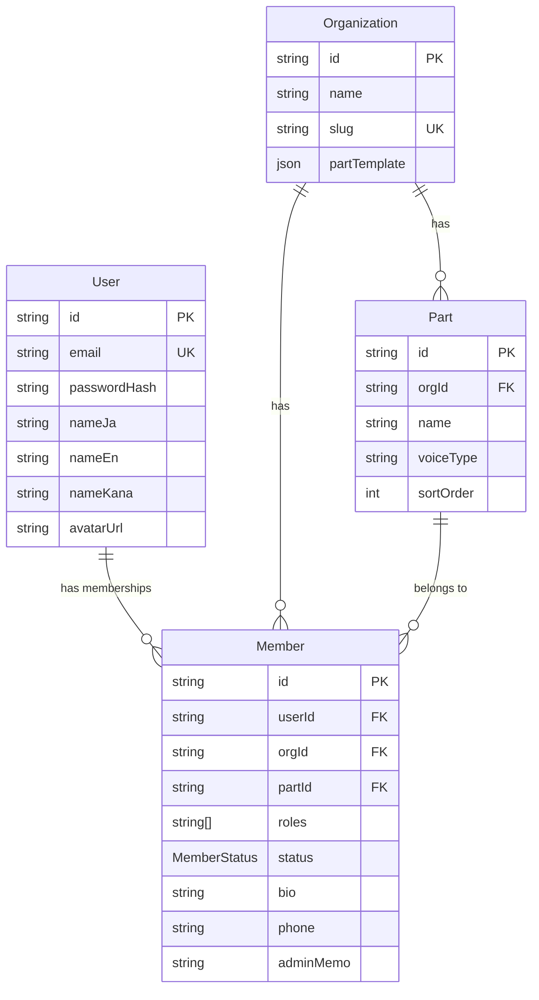
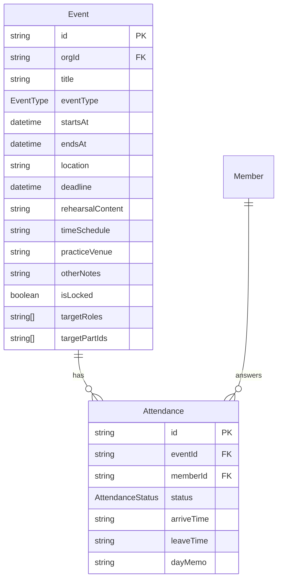
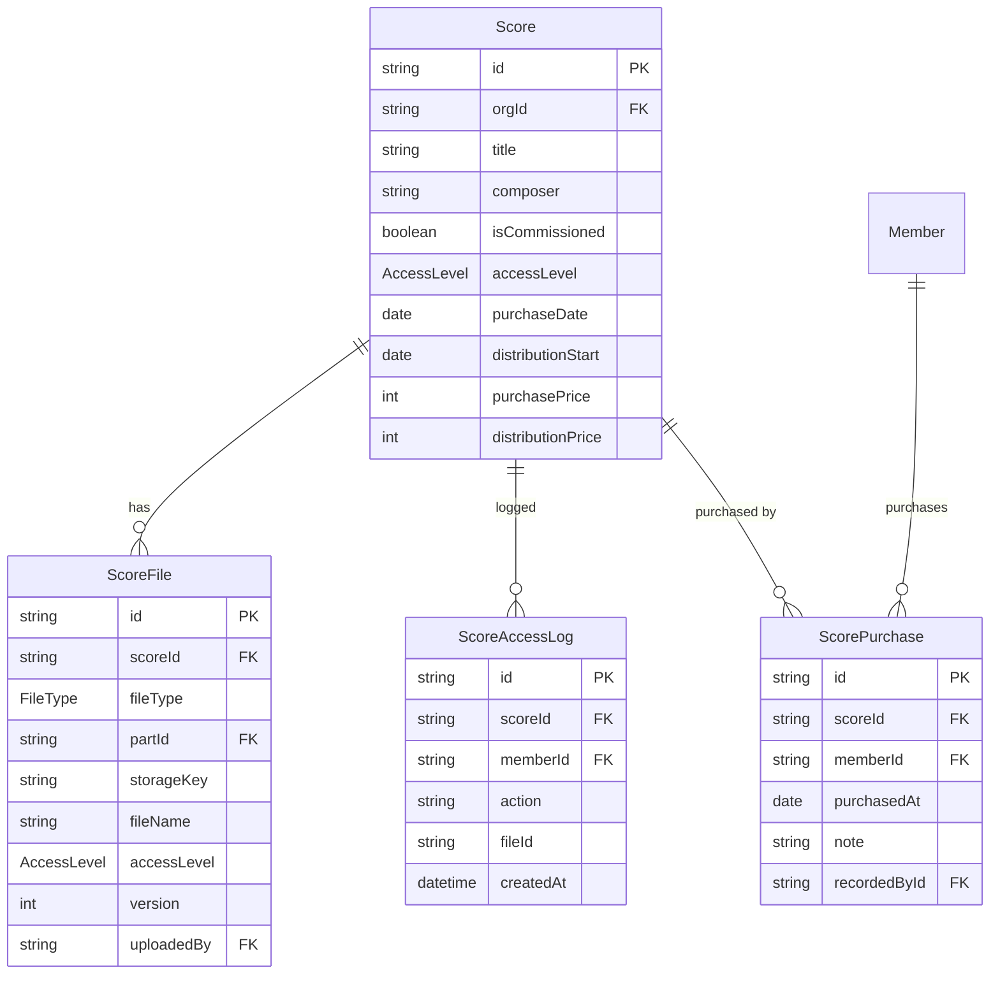
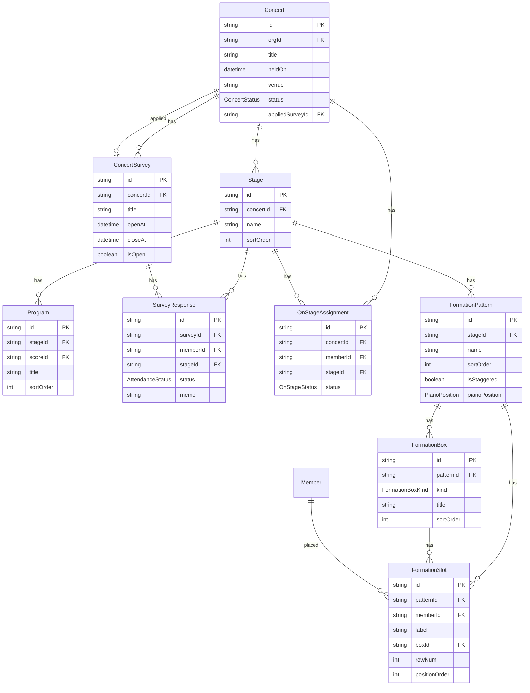
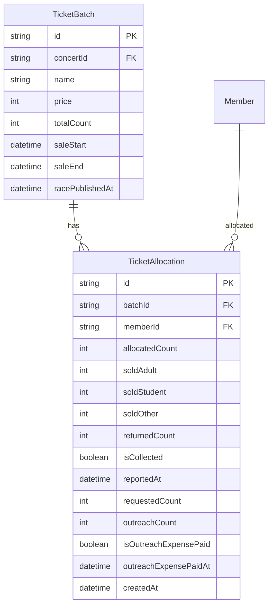
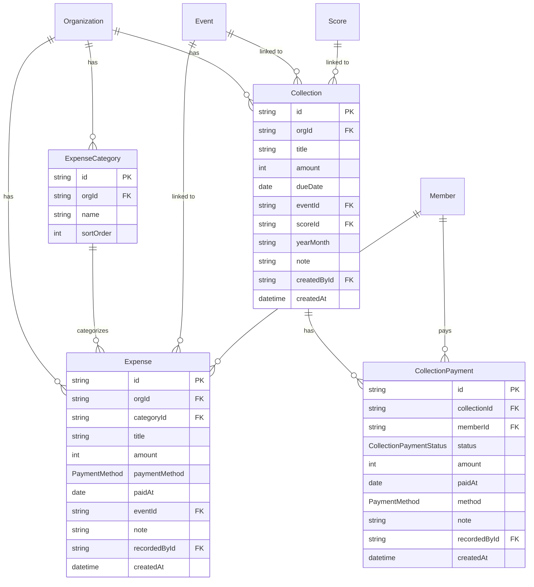

# ChoirHub DB設計書

**バージョン**: 1.8  
**作成日**: 2026-06-04  
**更新日**: 2026-07-21  
**対応 Prisma Schema**: `apps/api/prisma/schema.prisma`

---

## 目次

1. [ER図](#1-er図)
2. [テーブル定義](#2-テーブル定義)
3. [インデックス定義](#3-インデックス定義)
4. [設計方針・制約](#4-設計方針制約)

---

## 1. ER図

### 1.1 全体概要

```mermaid
erDiagram
    User           ||--o{ Member               : "has memberships"
    User           ||--o{ PasswordResetToken  : "requests"

    Organization ||--o{ Member                 : "has"
    Organization ||--o{ Part                   : "has"
    Organization ||--o{ Event                  : "has"
    Organization ||--o{ Score                  : "has"
    Organization ||--o{ Concert                : "has"
    Organization ||--o{ MailLog                : "has"
    Organization ||--o{ InviteToken            : "has"
    Organization ||--o{ Expense                : "has"
    Organization ||--o{ ExpenseCategory  : "has"
    Organization ||--o{ MemberType       : "has"
    Organization ||--o{ Collection             : "has"

    Part             ||--o{ Member : "belongs to"
    MemberType ||--o{ Member : "categorizes"

    Member ||--o{ Attendance          : "answers"
    Member ||--o{ SurveyResponse      : "answers"
    Member ||--o{ OnStageAssignment   : "assigned"
    Member ||--o{ FormationSlot       : "placed"
    Member ||--o{ TicketAllocation    : "allocated"
    Member ||--o{ MailLog             : "sends"
    Member ||--o{ ScoreAccessLog      : "logs"
    Member ||--o{ ScorePurchase       : "purchases"
    Member ||--o{ CollectionPayment   : "pays"
    Member ||--o{ Expense             : "records"

    Event  ||--o{ Attendance    : "has"
    Event  ||--o{ Expense       : "linked to"
    Event  ||--o{ Collection    : "linked to"

    Score  ||--o{ ScoreFile      : "has"
    Score  ||--o{ ScoreAccessLog : "logged"
    Score  ||--o{ Program        : "used in"
    Score  ||--o{ ScorePurchase  : "purchased by"

    Concert ||--o{ Stage             : "has"
    Concert ||--o{ OnStageAssignment : "has"
    Concert ||--o{ ConcertSurvey     : "has"
    Concert ||--o{ TicketBatch       : "has"
    Concert ||--o| Event             : "linked event"

    Organization ||--o{ MailTemplate : "has"
    Member       ||--o{ MailTemplate : "creates"

    Stage   ||--o{ Program           : "has"

    Stage   ||--o{ OnStageAssignment : "has"
    Stage   ||--o{ SurveyResponse    : "has"
    Stage   ||--o{ FormationPattern  : "has"

    FormationPattern ||--o{ FormationBox  : "has"
    FormationPattern ||--o{ FormationSlot : "has"
    FormationBox      ||--o{ FormationSlot : "has"

    ConcertSurvey ||--o{ SurveyResponse : "has"
    Concert       ||--o| ConcertSurvey  : "applied"

    TicketBatch    ||--o{ TicketAllocation : "has"
    Collection     ||--o{ CollectionPayment : "has"
    ExpenseCategory ||--o{ Expense   : "categorizes"
```



### 1.2 コアドメイン（ユーザー・団体・メンバー）



### 1.3 スケジュール・出欠



### 1.4 楽譜管理



### 1.5 本番・オンステ管理



### 1.6 チケット管理



### 1.7 会計管理



---

## 2. テーブル定義

### User（ユーザーアカウント）

> 認証エンティティ。1つのメールアドレスで複数団体に所属できる。

| カラム       | 型        | 制約                    | 説明                       |
| ------------ | --------- | ----------------------- | -------------------------- |
| id           | CUID      | PK                      |                            |
| email        | VARCHAR   | NOT NULL, UNIQUE        | ログインID・全団体共通     |
| passwordHash | VARCHAR   | NOT NULL                | ハッシュ化済みパスワード   |
| nameJa       | VARCHAR   | NOT NULL                | 氏名（日本語）             |
| nameEn       | VARCHAR   |                         | 氏名（ローマ字）           |
| nameKana     | VARCHAR   |                         | 氏名（カナ）               |
| avatarUrl    | VARCHAR   |                         | プロフィール画像 URL（R2） |
| createdAt    | TIMESTAMP | NOT NULL, DEFAULT now() |                            |

---

### Session（認証セッション）

> Lucia v3 が管理するセッションテーブル。アプリ側で直接操作しない。

| カラム    | 型        | 制約                | 説明                         |
| --------- | --------- | ------------------- | ---------------------------- |
| id        | VARCHAR   | PK                  | Lucia が生成するセッションID |
| userId    | CUID      | NOT NULL, FK → User |                              |
| expiresAt | TIMESTAMP | NOT NULL            | セッション有効期限           |

---

### Organization（団体）

| カラム                      | 型        | 制約                               | 説明                                                                                                                             |
| --------------------------- | --------- | ---------------------------------- | -------------------------------------------------------------------------------------------------------------------------------- |
| id                          | CUID      | PK                                 |                                                                                                                                  |
| name                        | VARCHAR   | NOT NULL                           | 団体名                                                                                                                           |
| slug                        | VARCHAR   | NOT NULL, UNIQUE                   | URLパスに使う識別子（例: `tokyo-men-choir`）                                                                                     |
| partTemplate                | JSONB     | NOT NULL                           | パート構成テンプレート（初期パート作成用）                                                                                       |
| feeType                     | ENUM      | NOT NULL, DEFAULT `per_rehearsal`  | 徴収方式（per_rehearsal / monthly）                                                                                              |
| defaultFeeAmount            | INT       |                                    | デフォルト徴収金額（円）。Collection 自動生成時の初期値                                                                          |
| monthlyOrganizer            | VARCHAR   |                                    | 今月の飲み会幹事パート名（ホーム画面表示用）                                                                                     |
| visitorFormToken            | VARCHAR   | UNIQUE                             | 見学申込Webhook用トークン（未発行時はNULL）                                                                                      |
| visitorIntroSubjectTemplate | VARCHAR   | NOT NULL, DEFAULT `見学者のご紹介` | 見学者紹介文（メール件名）のテンプレート                                                                                         |
| visitorIntroBodyTemplate    | VARCHAR   | NOT NULL                           | 見学者紹介文（本文）のテンプレート。`{lines}` に見学者ごとの行が展開される                                                       |
| visitorIntroLineTemplate    | VARCHAR   | NOT NULL                           | 見学者1名分の行テンプレート。`{name}` `{part}` `{origin}` を使用可能。`[...]` で囲むと中の変数が空の場合その区間ごと非表示になる |
| createdAt                   | TIMESTAMP | NOT NULL, DEFAULT now()            |                                                                                                                                  |

---

### Part（パート）

| カラム    | 型      | 制約                        | 説明                                  |
| --------- | ------- | --------------------------- | ------------------------------------- |
| id        | CUID    | PK                          |                                       |
| orgId     | CUID    | NOT NULL, FK → Organization |                                       |
| name      | VARCHAR | NOT NULL                    | 表示名（例: Tenor I, Bass）           |
| voiceType | VARCHAR | NOT NULL                    | 声部種別（tenor / bass / soprano 等） |
| sortOrder | INT     | NOT NULL                    | 表示順                                |
| isCustom  | BOOLEAN | NOT NULL, DEFAULT false     | 団固有のカスタムパートか              |

---

### Member（団体所属）

> 所属エンティティ。1ユーザーが複数団体に所属する場合、団体ごとに1レコード持つ。

| カラム       | 型        | 制約                           | 説明                                   |
| ------------ | --------- | ------------------------------ | -------------------------------------- |
| id           | CUID      | PK                             |                                        |
| userId       | CUID      | NOT NULL, FK → User            |                                        |
| orgId        | CUID      | NOT NULL, FK → Organization    |                                        |
| partId       | CUID      | FK → Part                      |                                        |
| memberTypeId | CUID      | FK → MemberType                | メンバー区分（任意）                   |
| roles        | VARCHAR[] | NOT NULL, DEFAULT `['member']` | この団でのロール一覧（下記参照）       |
| status       | ENUM      | NOT NULL, DEFAULT `active`     | active / offstage / alumni / suspended |
| bio          | TEXT      |                                | 一言自己紹介（全員閲覧可）             |
| job          | VARCHAR   |                                | 職業（全員閲覧可）                     |
| interests    | VARCHAR   |                                | 好きなもの（全員閲覧可）               |
| originGroup  | VARCHAR   |                                | 出身団体（全員閲覧可）                 |
| joinedAt     | DATE      |                                | 入団日（この団への）                   |
| phone        | VARCHAR   |                                | 電話番号（**admin のみ閲覧**）         |
| adminMemo    | TEXT      |                                | 管理者メモ（**admin のみ閲覧**）       |
| createdAt    | TIMESTAMP | NOT NULL, DEFAULT now()        |                                        |

**UNIQUE**: `(userId, orgId)`

#### roles に入る値（複数付与可）

| 値          | 説明                                     |
| ----------- | ---------------------------------------- |
| `admin`     | 全権限                                   |
| `tech`      | 選曲・ステージ・スケジュール管理         |
| `conductor` | 指揮者（現時点で `tech` と同等権限）     |
| `score`     | 楽譜購入・配布・閲覧許可管理             |
| `ticket`    | チケット配布設定・集計・パートレース公開 |
| `finance`   | 支出管理・場所代支払い記録               |
| `member`    | 一般（閲覧・出欠回答・チケット自己入力） |
| `guest`     | 客演（スケジュール・楽譜閲覧・出欠）     |
| `visitor`   | 体験（楽譜閲覧のみ・DL不可）             |

> `ticket` / `finance` / `conductor` は `member` と兼任して使用する（例: `["ticket", "member"]`）。

---

### Event（イベント）

| カラム           | 型        | 制約                         | 説明                                         |
| ---------------- | --------- | ---------------------------- | -------------------------------------------- |
| id               | CUID      | PK                           |                                              |
| orgId            | CUID      | NOT NULL, FK → Organization  |                                              |
| title            | VARCHAR   | NOT NULL                     | 例: 第○回定期練習                            |
| categoryId       | CUID      | NOT NULL, FK → EventCategory |                                              |
| startsAt         | TIMESTAMP | NOT NULL                     | 開始日時                                     |
| endsAt           | TIMESTAMP | NOT NULL                     | 終了日時                                     |
| location         | VARCHAR   |                              | 場所名                                       |
| locationUrl      | VARCHAR   |                              | Google Maps リンク等                         |
| deadline         | TIMESTAMP |                              | 出欠回答締切                                 |
| rehearsalContent | TEXT      |                              | 練習曲の内容                                 |
| timeSchedule     | TEXT      |                              | タイムスケジュール                           |
| practiceVenue    | TEXT      |                              | 練習会場（location とは別の補足自由記述）    |
| otherNotes       | TEXT      |                              | その他備考（管理者記入）                     |
| isLocked         | BOOLEAN   | NOT NULL, DEFAULT false      | 締切後ロック                                 |
| targetRoles      | VARCHAR[] | NOT NULL, DEFAULT `[]`       | 対象ロール絞り込み（空 = 全員）              |
| targetPartIds    | VARCHAR[] | NOT NULL, DEFAULT `[]`       | 対象パート絞り込み（空 = 全パート）          |
| concertId        | CUID      | UNIQUE, FK → Concert         | 演奏会リンク（1対1。演奏会作成時に自動生成） |
| createdAt        | TIMESTAMP | NOT NULL, DEFAULT now()      |                                              |

---

### Attendance（出欠）

| カラム     | 型        | 制約                          | 説明                                   |
| ---------- | --------- | ----------------------------- | -------------------------------------- |
| id         | CUID      | PK                            |                                        |
| eventId    | CUID      | NOT NULL, FK → Event          |                                        |
| memberId   | CUID      | NOT NULL, FK → Member         |                                        |
| status     | ENUM      | NOT NULL, DEFAULT `undecided` | attending / absent / maybe / undecided |
| arriveTime | VARCHAR   |                               | 遅刻時の到着予定（例: "18:30"）        |
| leaveTime  | VARCHAR   |                               | 早退時の退席予定（例: "20:00"）        |
| dayMemo    | TEXT      |                               | 個人メモ                               |
| updatedAt  | TIMESTAMP | NOT NULL                      |                                        |

**UNIQUE**: `(eventId, memberId)`

---

### Score（楽譜）

| カラム            | 型        | 制約                           | 説明                                             |
| ----------------- | --------- | ------------------------------ | ------------------------------------------------ |
| id                | CUID      | PK                             |                                                  |
| orgId             | CUID      | NOT NULL, FK → Organization    |                                                  |
| title             | VARCHAR   | NOT NULL                       | 曲名                                             |
| composer          | VARCHAR   |                                | 作曲者                                           |
| arranger          | VARCHAR   |                                | 編曲者                                           |
| isCommissioned    | BOOLEAN   | NOT NULL, DEFAULT false        | 委嘱曲フラグ                                     |
| accessLevel       | ENUM      | NOT NULL, DEFAULT `restricted` | secret / restricted / public                     |
| purchaseDate      | DATE      |                                | 楽譜購入日                                       |
| distributionStart | DATE      |                                | 団員への配布開始日                               |
| purchasePrice     | INT       |                                | 購入価格（**admin / score / finance のみ閲覧**） |
| distributionPrice | INT       |                                | 頒布価格（団員も閲覧可）                         |
| notes             | TEXT      |                                | 備考                                             |
| createdAt         | TIMESTAMP | NOT NULL, DEFAULT now()        |                                                  |

---

### ScoreFile（楽譜ファイル）

| カラム      | 型        | 制約                    | 説明                                           |
| ----------- | --------- | ----------------------- | ---------------------------------------------- |
| id          | CUID      | PK                      |                                                |
| scoreId     | CUID      | NOT NULL, FK → Score    |                                                |
| fileType    | ENUM      | NOT NULL                | full_score / part_score / midi / audio / other |
| partId      | CUID      | FK → Part               | パート別ファイルの場合に指定                   |
| storageKey  | VARCHAR   | NOT NULL                | R2 オブジェクトキー（直リンク不可）            |
| fileName    | VARCHAR   | NOT NULL                | 表示用ファイル名                               |
| accessLevel | ENUM      |                         | NULL = Score の accessLevel を継承             |
| version     | INT       | NOT NULL, DEFAULT 1     | バージョン番号                                 |
| uploadedBy  | CUID      | NOT NULL, FK → Member   |                                                |
| uploadedAt  | TIMESTAMP | NOT NULL, DEFAULT now() |                                                |

---

### ScoreAccessLog（楽譜アクセスログ）

| カラム    | 型        | 制約                    | 説明                     |
| --------- | --------- | ----------------------- | ------------------------ |
| id        | CUID      | PK                      |                          |
| scoreId   | CUID      | NOT NULL, FK → Score    |                          |
| memberId  | CUID      | NOT NULL, FK → Member   |                          |
| action    | VARCHAR   | NOT NULL                | "view" / "download"      |
| fileId    | CUID      | FK → ScoreFile          | ファイル単位のログの場合 |
| createdAt | TIMESTAMP | NOT NULL, DEFAULT now() |                          |

---

### ScorePurchase（楽譜購入記録）

> 楽譜がかりが団員の購入を記録する。購入記録の有無が楽譜DL権限の判定に使われる。`amount` は会計集計（楽譜代収入）に使用する。

| カラム       | 型        | 制約                    | 説明                                                  |
| ------------ | --------- | ----------------------- | ----------------------------------------------------- |
| id           | CUID      | PK                      |                                                       |
| scoreId      | CUID      | NOT NULL, FK → Score    |                                                       |
| memberId     | CUID      | NOT NULL, FK → Member   | 購入した団員                                          |
| amount       | INT       |                         | 頒布価格（円）。NULL = Score.distributionPrice を参照 |
| purchasedAt  | DATE      |                         | 購入日                                                |
| note         | TEXT      |                         | 備考                                                  |
| recordedById | CUID      | NOT NULL, FK → Member   | 登録した楽譜がかり                                    |
| createdAt    | TIMESTAMP | NOT NULL, DEFAULT now() |                                                       |

**UNIQUE**: `(scoreId, memberId)`

---

### Concert（演奏会）

| カラム                 | 型        | 制約                        | 説明                                         |
| ---------------------- | --------- | --------------------------- | -------------------------------------------- |
| id                     | CUID      | PK                          |                                              |
| orgId                  | CUID      | NOT NULL, FK → Organization |                                              |
| title                  | VARCHAR   | NOT NULL                    | 例: 第○回定期演奏会                          |
| heldOn                 | TIMESTAMP | NOT NULL                    | 本番日時                                     |
| venue                  | VARCHAR   |                             | 会場名                                       |
| status                 | ENUM      | NOT NULL, DEFAULT `draft`   | draft / survey_open / confirmed / past       |
| racePublishedAt        | TIMESTAMP |                             | パートレース公開日時（NULL = 未公開）        |
| ticketInputClosedAt    | TIMESTAMP |                             | チケット入力締め切り日時（NULL = 入力可能）  |
| outreachExpensePerTrip | INT       |                             | 情宣1回あたりの交通費（円）。NULL = 個別入力 |
| appliedSurveyId        | CUID      | FK → ConcertSurvey          | オンステ確定に反映済みの調査。NULL = 未反映  |
| createdAt              | TIMESTAMP | NOT NULL, DEFAULT now()     |                                              |

#### status 遷移

```text
draft → survey_open → confirmed → past
```

> **自動連動**: `ConcertSurvey` の開設（POST）または再開（PATCH isOpen: true）で `survey_open` に自動遷移。締め切り（PATCH isOpen: false）で `confirmed` に自動遷移し、その調査の回答が `OnStageAssignment` に反映されて `appliedSurveyId` が設定される。手動で `survey_open` にはできない。調査が複数ある場合、管理者は締切後に別の調査を選んで明示的に反映し直せる（`POST .../surveys/:surveyId/apply`。この操作は status を変更しない）。

---

### Stage（ステージ）

| カラム    | 型      | 制約                   | 説明            |
| --------- | ------- | ---------------------- | --------------- |
| id        | CUID    | PK                     |                 |
| concertId | CUID    | NOT NULL, FK → Concert |                 |
| name      | VARCHAR | NOT NULL               | 例: 第1ステージ |
| sortOrder | INT     | NOT NULL               | 表示順          |

---

### Program（演目）

| カラム    | 型      | 制約                 | 説明                                      |
| --------- | ------- | -------------------- | ----------------------------------------- |
| id        | CUID    | PK                   |                                           |
| stageId   | CUID    | NOT NULL, FK → Stage |                                           |
| scoreId   | CUID    | FK → Score           | NULL = Score 未紐付け（タイトル直接入力） |
| title     | VARCHAR | NOT NULL             | 曲名（Score と非連動で入力可）            |
| sortOrder | INT     | NOT NULL             | 演奏順                                    |

---

### ConcertSurvey（オンステ調査）

| カラム    | 型        | 制約                   | 説明                                   |
| --------- | --------- | ---------------------- | -------------------------------------- |
| id        | CUID      | PK                     |                                        |
| concertId | CUID      | NOT NULL, FK → Concert |                                        |
| title     | VARCHAR   | NOT NULL               | 調査タイトル（例: 第○回定演 出演調査） |
| openAt    | TIMESTAMP | NOT NULL               | 調査開始日時                           |
| closeAt   | TIMESTAMP |                        | 調査締切日時（NULL = 手動クローズ）    |
| isOpen    | BOOLEAN   | NOT NULL, DEFAULT true |                                        |

---

### SurveyResponse（オンステ調査回答）

> 演目（Program）単位ではなく**ステージ（Stage）単位**で回答を記録する。画面はステージ × メンバーのマトリクスビューで表示する。メモはメンバーごとに1つ（全ステージ共通）。`status` は `Attendance`（スケジュールの出欠）と列自体は共有するが、オンステ調査では `maybe`（未定）は使わず出席/欠席/未回答の3択のみを受け付ける（API バリデーションで制限）。

| カラム   | 型   | 制約                          | 説明                                           |
| -------- | ---- | ----------------------------- | ---------------------------------------------- |
| id       | CUID | PK                            |                                                |
| surveyId | CUID | NOT NULL, FK → ConcertSurvey  |                                                |
| memberId | CUID | NOT NULL, FK → Member         |                                                |
| stageId  | CUID | NOT NULL, FK → Stage          |                                                |
| status   | ENUM | NOT NULL, DEFAULT `undecided` | attending / absent / maybe / undecided         |
| memo     | TEXT |                               | メモ（全ステージ共通・最初の非 null 値を参照） |

**UNIQUE**: `(surveyId, memberId, stageId)`

---

### OnStageAssignment（オンステ確定）

> 演目（Program）単位ではなく**ステージ（Stage）単位**で出欠を記録する（SurveyResponse と同じ粒度）。

| カラム    | 型   | 制約                          | 説明                 |
| --------- | ---- | ----------------------------- | -------------------- |
| id        | CUID | PK                            |                      |
| concertId | CUID | NOT NULL, FK → Concert        |                      |
| memberId  | CUID | NOT NULL, FK → Member         |                      |
| stageId   | CUID | NOT NULL, FK → Stage          |                      |
| status    | ENUM | NOT NULL, DEFAULT `undecided` | on / off / undecided |

**UNIQUE**: `(concertId, memberId, stageId)`

---

### FormationPattern（フォーメーションパターン）

> ステージごとに複数作成できる立ち位置パターン（曲によって配置を変える場合などに使う）。パターン作成時に `FormationBox`（指揮・ピアノの2件）が自動作成される。

| カラム        | 型      | 制約                       | 説明                                   |
| ------------- | ------- | -------------------------- | -------------------------------------- |
| id            | CUID    | PK                         |                                        |
| stageId       | CUID    | NOT NULL, FK → Stage       |                                        |
| name          | VARCHAR | NOT NULL                   | パターン名（例: パターン1）            |
| sortOrder     | INT     | NOT NULL                   | 表示順                                 |
| isStaggered   | BOOLEAN | NOT NULL, DEFAULT false    | 山台の段を半人分ずつ互い違いにずらすか |
| pianoPosition | ENUM    | NOT NULL, DEFAULT `center` | center / kamite（ピアノの表示位置）    |

---

### FormationBox（指揮・ピアノ・カスタム枠）

> 山台の段（`FormationSlot.rowNum`）とは別に、指揮・ピアノ・ソロ/楽器などの立ち位置を表す枠。conductor / piano はパターン作成時に1件ずつ自動作成される固定枠、custom は管理者が任意に追加する枠。

| カラム    | 型      | 制約                            | 説明                                      |
| --------- | ------- | ------------------------------- | ----------------------------------------- |
| id        | CUID    | PK                              |                                           |
| patternId | CUID    | NOT NULL, FK → FormationPattern |                                           |
| kind      | ENUM    | NOT NULL                        | conductor / piano / custom                |
| title     | VARCHAR |                                 | 枠名（custom のみ使用。例: ソロ、打楽器） |
| sortOrder | INT     | NOT NULL                        | 表示順                                    |

---

### FormationSlot（山台・枠への配置）

> 「山台の段」と「枠（FormationBox）」のどちらか一方に配置されるスロット。`boxId` が設定されていれば枠内の配置、NULL なら `rowNum`（山台の段番号）による配置で、両者は排他（アプリ側の Zod バリデーションで担保）。`memberId` が NULL の場合は客演など団員外の出演者で、`label` に表示名を保持する。`memberId` を指定する場合、そのメンバーが当該ステージで `OnStageAssignment.status: "on"` であることをAPI側で検証する（DB制約ではなくアプリ側で担保）。

| カラム        | 型      | 制約                            | 説明                                           |
| ------------- | ------- | ------------------------------- | ---------------------------------------------- |
| id            | CUID    | PK                              |                                                |
| patternId     | CUID    | NOT NULL, FK → FormationPattern |                                                |
| memberId      | CUID    | FK → Member                     | NULL = 客演など団員外（label で表示名を保持）  |
| label         | VARCHAR |                                 | 丸バッジの表示名の上書き、または客演・指揮者名 |
| boxId         | CUID    | FK → FormationBox               | 枠に配置する場合に設定（rowNum とは排他）      |
| rowNum        | INT     |                                 | 山台の段番号（1始まり）。boxId とは排他        |
| positionOrder | INT     | NOT NULL                        | 枠内での並び順、または山台グリッドの列番号     |

---

### MailLog（メール送信ログ）

> 件名・本文冒頭（200字）は送信時に DB へ保存し、一覧画面は DB のみで完結する。メール本文 HTML は詳細画面でのみ Resend API から取得する。

| カラム             | 型        | 制約                        | 説明                                                             |
| ------------------ | --------- | --------------------------- | ---------------------------------------------------------------- |
| id                 | CUID      | PK                          |                                                                  |
| orgId              | CUID      | NOT NULL, FK → Organization |                                                                  |
| sentById           | CUID      | NOT NULL, FK → Member       | 送信者                                                           |
| sentAt             | TIMESTAMP | NOT NULL, DEFAULT now()     |                                                                  |
| subject            | VARCHAR   | NOT NULL, DEFAULT `""`      | 件名（一覧表示用）                                               |
| bodyPreview        | VARCHAR   | NOT NULL, DEFAULT `""`      | 本文冒頭 200 字（一覧表示用）                                    |
| resendIds          | VARCHAR[] | NOT NULL, DEFAULT `[]`      | Resend メール ID 一覧（DEV環境では DEV_MAIL_TO に集約のため1件） |
| recipientMemberIds | VARCHAR[] | NOT NULL, DEFAULT `[]`      | 受信者メンバー ID 一覧（アクセス制御・フィルタ用）               |

---

### TicketBatch（チケット席種）

| カラム          | 型        | 制約                   | 説明                                                         |
| --------------- | --------- | ---------------------- | ------------------------------------------------------------ |
| id              | CUID      | PK                     |                                                              |
| concertId       | CUID      | NOT NULL, FK → Concert |                                                              |
| name            | VARCHAR   | NOT NULL               | 席種名（例: 一般・学生・招待）                               |
| price           | INT       | NOT NULL               | 大人販売価格（円）                                           |
| priceStudent    | INT       |                        | 学生販売価格（円、NULL = 大人と同額）                        |
| totalCount      | INT       | NOT NULL               | 総発行枚数                                                   |
| saleStart       | TIMESTAMP |                        | 販売開始日時                                                 |
| saleEnd         | TIMESTAMP |                        | 販売終了日時                                                 |
| racePublishedAt | TIMESTAMP |                        | 席種別パートレース公開日時（Concert.racePublishedAt が優先） |

---

### TicketAllocation（チケット配布・回収）

| カラム                | 型        | 制約                       | 説明                                    |
| --------------------- | --------- | -------------------------- | --------------------------------------- |
| id                    | CUID      | PK                         |                                         |
| batchId               | CUID      | NOT NULL, FK → TicketBatch |                                         |
| memberId              | CUID      | NOT NULL, FK → Member      |                                         |
| allocatedCount        | INT       | NOT NULL, DEFAULT 0        | 配布枚数（ticket / admin が設定）       |
| soldAdult             | INT       | NOT NULL, DEFAULT 0        | 大人販売済み枚数（本人入力）            |
| soldStudent           | INT       | NOT NULL, DEFAULT 0        | 学生販売済み枚数（本人入力）            |
| soldOther             | INT       | NOT NULL, DEFAULT 0        | その他販売済み枚数（本人入力）          |
| returnedCount         | INT       | NOT NULL, DEFAULT 0        | 未販売返却枚数（本人入力）              |
| outreachCount         | INT       | NOT NULL, DEFAULT 0        | 情宣活動回数（本人入力）                |
| requestedCount        | INT       |                            | 本人が希望した配布枚数（NULL = 未申請） |
| isCollected           | BOOLEAN   | NOT NULL, DEFAULT false    | 集金済みフラグ（ticket / admin が更新） |
| isOutreachExpensePaid | BOOLEAN   | NOT NULL, DEFAULT false    | 情宣交通費支払済みフラグ                |
| outreachExpensePaidAt | TIMESTAMP |                            | 情宣交通費支払日時                      |
| reportedAt            | TIMESTAMP |                            | 回収報告日時                            |

---

### InviteToken（招待トークン）

> 招待メール経由の入団フローで使用する使い捨てトークン。

| カラム    | 型        | 制約                        | 説明                           |
| --------- | --------- | --------------------------- | ------------------------------ |
| id        | CUID      | PK                          |                                |
| token     | VARCHAR   | NOT NULL, UNIQUE            | URL埋め込み用トークン          |
| email     | VARCHAR   | NOT NULL                    | 招待先メールアドレス           |
| nameJa    | VARCHAR   |                             | 招待時に設定する氏名（任意）   |
| orgId     | CUID      | NOT NULL, FK → Organization |                                |
| roles     | VARCHAR[] | NOT NULL                    | 入団時に付与するロール         |
| partId    | CUID      | FK → Part                   | 入団時に設定するパート（任意） |
| expiresAt | TIMESTAMP | NOT NULL                    | 有効期限                       |
| usedAt    | TIMESTAMP |                             | 使用日時（NULL = 未使用）      |
| createdAt | TIMESTAMP | NOT NULL, DEFAULT now()     |                                |

---

### PasswordResetToken（パスワードリセットトークン）

> パスワードリセットメール経由で使用する使い捨てトークン。1時間有効。使用後は usedAt が設定される。

| カラム    | 型        | 制約                    | 説明                      |
| --------- | --------- | ----------------------- | ------------------------- |
| id        | CUID      | PK                      |                           |
| token     | VARCHAR   | NOT NULL, UNIQUE        | URL埋め込み用トークン     |
| userId    | CUID      | NOT NULL, FK → User     | リセット対象ユーザー      |
| expiresAt | TIMESTAMP | NOT NULL                | 有効期限（発行から1時間） |
| usedAt    | TIMESTAMP |                         | 使用日時（NULL = 未使用） |
| createdAt | TIMESTAMP | NOT NULL, DEFAULT now() |                           |

- トークン使用時に全セッションを削除する（不正アクセス排除）
- ユーザーが存在しないメールアドレスで申請しても同一レスポンスを返す（ユーザー列挙防止）

---

### ExpenseCategory（支出カテゴリマスタ）

> 団ごとにカスタマイズできる支出カテゴリ。団体作成時に下記デフォルト値が投入される。

| カラム    | 型        | 制約                        | 説明                                 |
| --------- | --------- | --------------------------- | ------------------------------------ |
| id        | CUID      | PK                          |                                      |
| orgId     | CUID      | NOT NULL, FK → Organization |                                      |
| name      | VARCHAR   | NOT NULL                    | カテゴリ名（例: 会場費、指導者謝礼） |
| sortOrder | INT       | NOT NULL, DEFAULT 0         | 表示順                               |
| createdAt | TIMESTAMP | NOT NULL, DEFAULT now()     |                                      |

**デフォルト値（団体作成時に自動投入）**: 会場費 / 指導者謝礼 / 楽譜費 / 合宿費 / 本番費 / 飲み会費 / 雑費

---

### MemberType（メンバー区分マスタ）

> 団ごとにカスタマイズできるメンバー区分（社会人・学生・遠隔など）。Member に FK で紐付き、区分ごとにデフォルト会費を持てる。

| カラム           | 型        | 制約                        | 説明                                          |
| ---------------- | --------- | --------------------------- | --------------------------------------------- |
| id               | CUID      | PK                          |                                               |
| orgId            | CUID      | NOT NULL, FK → Organization |                                               |
| name             | VARCHAR   | NOT NULL                    | 区分名（例: 社会人、学生）                    |
| defaultFeeAmount | INT       |                             | この区分のデフォルト会費（円）。NULL = 未設定 |
| sortOrder        | INT       | NOT NULL, DEFAULT 0         | 表示順                                        |
| createdAt        | TIMESTAMP | NOT NULL, DEFAULT now()     |                                               |

**制約**: `(orgId, name)` UNIQUE

**利用場面**: Collection 作成時に各 Member の `memberType.defaultFeeAmount` を参照し、Collection.amount と異なる場合は `CollectionPayment.amount` に個別金額を設定する。

---

### Expense（支出）

> 会計係が管理する団の支出記録。

| カラム        | 型        | 制約                           | 説明                                  |
| ------------- | --------- | ------------------------------ | ------------------------------------- |
| id            | CUID      | PK                             |                                       |
| orgId         | CUID      | NOT NULL, FK → Organization    |                                       |
| categoryId    | CUID      | NOT NULL, FK → ExpenseCategory |                                       |
| title         | VARCHAR   | NOT NULL                       | 内容（例: 市民会館 第2練習室 6/14分） |
| amount        | INT       | NOT NULL                       | 金額（円）                            |
| paymentMethod | ENUM      |                                | cash / paypay / bank_transfer / other |
| paidAt        | DATE      |                                | 支払日                                |
| eventId       | CUID      | FK → Event                     | 関連イベント（任意）                  |
| note          | TEXT      |                                | 備考                                  |
| recordedById  | CUID      | NOT NULL, FK → Member          | 登録した会計係                        |
| createdAt     | TIMESTAMP | NOT NULL, DEFAULT now()        |                                       |

---

### Collection（徴収）

> 場所代・月会費・合宿費など、団員から徴収するお金の定義。会計係が作成し、対象団員分の `CollectionPayment` が自動生成される。

| カラム      | 型        | 制約                        | 説明                                            |
| ----------- | --------- | --------------------------- | ----------------------------------------------- |
| id          | CUID      | PK                          |                                                 |
| orgId       | CUID      | NOT NULL, FK → Organization |                                                 |
| title       | VARCHAR   | NOT NULL                    | 徴収名（例: 6/14練習 場所代、2026年6月 月会費） |
| amount      | INT       | NOT NULL                    | 一人あたりの請求額（円）                        |
| dueDate     | DATE      |                             | 支払期限（任意）                                |
| eventId     | CUID      | FK → Event                  | 関連イベント（per_rehearsal モード時に設定）    |
| scoreId     | CUID      | FK → Score                  | 関連楽譜（楽譜詳細から作成した場合）            |
| yearMonth   | VARCHAR   |                             | 対象年月（例: `2026-06`）月会費モード時に設定   |
| note        | TEXT      |                             | 備考                                            |
| createdById | CUID      | NOT NULL, FK → Member       | 作成した会計係                                  |
| createdAt   | TIMESTAMP | NOT NULL, DEFAULT now()     |                                                 |

**自動生成ルール**:

- `per_rehearsal` モード: 練習イベント（`eventType = rehearsal`）作成時に自動生成
- `monthly` モード: 会計係が「今月の会費を発行」を実行したときに生成
- いずれの場合も、生成直後に全アクティブ団員（`status = active` かつ `visitor` ロール除く）の `CollectionPayment`（`status = pending`）が自動作成される

---

### CollectionPayment（徴収支払い記録）

> Collection に対する団員ごとの支払い状況。Collection 作成時に全対象団員分が `pending` で自動生成される。

| カラム       | 型        | 制約                        | 説明                                                                         |
| ------------ | --------- | --------------------------- | ---------------------------------------------------------------------------- |
| id           | CUID      | PK                          |                                                                              |
| collectionId | CUID      | NOT NULL, FK → Collection   |                                                                              |
| memberId     | CUID      | NOT NULL, FK → Member       |                                                                              |
| status       | ENUM      | NOT NULL, DEFAULT `pending` | pending / paid / waived                                                      |
| amount       | INT       |                             | 実際の支払い額（円）。paid になったとき設定。NULL = Collection.amount を参照 |
| paidAt       | DATE      |                             | 支払日（paid のとき必須）                                                    |
| method       | ENUM      |                             | 支払方法: cash / paypay / bank_transfer / other                              |
| note         | TEXT      |                             | 備考（例: 欠席のため免除）                                                   |
| recordedById | CUID      | FK → Member                 | 記録した会計係（自動生成分は NULL）                                          |
| createdAt    | TIMESTAMP | NOT NULL, DEFAULT now()     |                                                                              |

**UNIQUE**: `(collectionId, memberId)`

#### status の意味

| 値        | 意味                             |
| --------- | -------------------------------- |
| `pending` | 未払い（自動生成時のデフォルト） |
| `paid`    | 支払済み                         |
| `waived`  | 免除（欠席・特例等）             |

---

## 3. インデックス定義

| テーブル           | カラム                         | 種別   | 目的                                |
| ------------------ | ------------------------------ | ------ | ----------------------------------- |
| Organization       | slug                           | UNIQUE | テナント識別子の検索                |
| User               | email                          | UNIQUE | ログイン認証                        |
| Member             | (userId, orgId)                | UNIQUE | 1ユーザーが同一団体に重複所属しない |
| Member             | userId                         | INDEX  | ユーザーの所属団体一覧取得          |
| Member             | orgId                          | INDEX  | テナント絞り込み                    |
| Member             | (orgId, partId)                | INDEX  | パート別メンバー一覧                |
| InviteToken        | token                          | INDEX  | トークン検索                        |
| PasswordResetToken | token                          | UNIQUE | トークン検索                        |
| PasswordResetToken | userId                         | INDEX  | ユーザー別トークン取得              |
| Event              | (orgId, startsAt)              | INDEX  | 月カレンダー表示                    |
| Attendance         | (eventId, memberId)            | UNIQUE | 重複回答防止                        |
| Score              | (orgId, accessLevel)           | INDEX  | 権限別楽譜一覧                      |
| ScoreFile          | scoreId                        | INDEX  | 楽譜に紐づくファイル取得            |
| ScoreAccessLog     | (scoreId, createdAt)           | INDEX  | アクセス履歴の時系列取得            |
| ScorePurchase      | (scoreId, memberId)            | UNIQUE | 同一楽譜の重複購入登録防止          |
| ScorePurchase      | scoreId                        | INDEX  | 楽譜別購入者一覧                    |
| Concert            | (orgId, heldOn)                | INDEX  | 本番一覧の日付ソート                |
| Program            | (stageId, sortOrder)           | INDEX  | 演目の表示順取得                    |
| SurveyResponse     | (surveyId, memberId, stageId)  | UNIQUE | 重複回答防止                        |
| OnStageAssignment  | (concertId, memberId, stageId) | UNIQUE | 重複登録防止                        |
| FormationPattern   | (stageId, sortOrder)           | INDEX  | パターンの表示順取得                |
| FormationBox       | (patternId, sortOrder)         | INDEX  | 枠の表示順取得                      |
| FormationSlot      | patternId                      | INDEX  | パターンに紐づくスロット取得        |
| FormationSlot      | boxId                          | INDEX  | 枠に紐づくスロット取得              |
| MailLog            | (orgId, sentAt)                | INDEX  | メール履歴の時系列取得              |
| TicketAllocation   | (batchId, memberId)            | INDEX  | 団員別チケット集計                  |
| Collection         | orgId                          | INDEX  | 団ごとの徴収一覧取得                |
| Collection         | (orgId, yearMonth)             | INDEX  | 月会費の月次検索                    |
| Collection         | scoreId                        | INDEX  | 楽譜別の徴収取得                    |
| CollectionPayment  | (collectionId, memberId)       | UNIQUE | 重複記録防止                        |
| CollectionPayment  | collectionId                   | INDEX  | 徴収別の支払い状況取得              |
| Expense            | (orgId, paidAt)                | INDEX  | 支出一覧の時系列取得                |

---

## 4. 設計方針・制約

### 4.1 User と Member の役割分担

| 項目           | User                                   | Member                |
| -------------- | -------------------------------------- | --------------------- |
| スコープ       | グローバル（全団体共通）               | 団体ごと              |
| 認証情報       | email / passwordHash                   | —                     |
| 名前・アバター | nameJa / nameEn / nameKana / avatarUrl | —                     |
| ロール・パート | —                                      | roles / partId        |
| 自己紹介など   | —                                      | bio / job / interests |
| 管理者メモ     | —                                      | adminMemo / phone     |

セッションは `User` に紐付き、APIミドルウェアがリクエストの `orgSlug` を見て対応する `Member` レコードを解決し `ctx.member` にセットする。

### 4.2 マルチテナント分離

- すべてのデータは `orgId` で団体ごとに分離する
- APIミドルウェアが `orgSlug → orgId` を解決し、以降の全クエリに自動付与する
- アプリケーション層でテナント分離を保証する（PostgreSQL RLS は補助的に検討）

### 4.3 論理削除を使わない方針

- メンバーの「退団」は `status = alumni` で表現する（物理削除しない）
- イベントや楽譜の削除は物理削除とするが、関連する Attendance・ScoreAccessLog は保持する

### 4.4 ファイルストレージ

- `ScoreFile.storageKey` は Cloudflare R2 のオブジェクトキーのみ保存する
- ダウンロード時は API 側で Presigned URL を発行する（有効期限: 5分）
- ファイルの直リンクは禁止する

### 4.5 権限判定の実装位置

- ロールによるアクセス制御は API ミドルウェアで完結させる
- `phone` / `adminMemo` は `admin` ロール保有者のみ参照可能
- `purchasePrice` は `admin` / `score` / `finance` ロール保有者のみ参照可能
- これらのフィールドはクエリ SELECT 時にロールを見てマスキングする

### 4.6 ENUM 定義まとめ

| ENUM名                   | 値                                             |
| ------------------------ | ---------------------------------------------- |
| MemberStatus             | active / offstage / alumni / suspended         |
| AttendanceStatus         | attending / absent / maybe / undecided         |
| AccessLevel              | secret / restricted / public                   |
| FileType                 | full_score / part_score / midi / audio / other |
| ConcertStatus            | draft / survey_open / confirmed / past         |
| OnStageStatus            | on / off / undecided                           |
| PianoPosition            | center / kamite                                |
| FormationBoxKind         | conductor / piano / custom                     |
| FeeType                  | per_rehearsal / monthly                        |
| PaymentMethod            | cash / paypay / bank_transfer / other          |
| CollectionPaymentStatus  | pending / paid / waived                        |
| VisitorApplicationStatus | pending / approved / rejected                  |

### 4.7 命名規則（Prisma `@map` 規約）

Prisma クライアント側とDB側で命名規則を分離する。

| 対象                    | 規則               | 例                            |
| ----------------------- | ------------------ | ----------------------------- |
| Prisma モデル名         | PascalCase・単数形 | `Member`, `EventCategory`     |
| Prisma フィールド名     | camelCase          | `createdById`, `heldOn`       |
| DBテーブル名（`@@map`） | snake_case・複数形 | `members`, `event_categories` |
| DBカラム名（`@map`）    | snake_case         | `created_by_id`, `held_on`    |

- `@map("snake_case")` をカラムに付与し、Prismaクライアントは camelCase で扱う
- モデル名に `Master` サフィックスは付けない（`EventCategory` / `MemberType` / `ExpenseCategory`）
- Boolean フィールドには `is` プレフィックスを付ける（`isCollected`, `isOutreachExpensePaid`）
- FK フィールドには `Id` サフィックスを付ける（`createdById`, `recordedById`）

### EventCategory（イベント区分マスタ）

| カラム    | 型        | 制約                        | 説明                                                                                     |
| --------- | --------- | --------------------------- | ---------------------------------------------------------------------------------------- |
| id        | CUID      | PK                          |                                                                                          |
| orgId     | CUID      | NOT NULL, FK → Organization |                                                                                          |
| name      | VARCHAR   | NOT NULL                    | 表示名（例: 練習・本番）                                                                 |
| slug      | VARCHAR   |                             | システム標準区分の識別子。rehearsal / concert / meeting / other。ユーザー作成区分は null |
| color     | VARCHAR   | NOT NULL, DEFAULT `#6B7280` | 16進カラーコード                                                                         |
| sortOrder | INT       | NOT NULL, DEFAULT 0         |                                                                                          |
| createdAt | TIMESTAMP | NOT NULL, DEFAULT now()     |                                                                                          |

- `@@unique([orgId, name])` — 同一団体内での名前重複を禁止
- `@@unique([orgId, slug])` — 同一団体内での slug 重複を禁止（slug が null の行は複数許容）
- slug が null でない区分（標準4種）は削除不可、名前・色の変更のみ可
- Concert自動生成・per_rehearsal会費自動生成は `slug === "concert" / "rehearsal"` で判定

### MailTemplate（メールテンプレート）

| カラム      | 型        | 制約                        | 説明           |
| ----------- | --------- | --------------------------- | -------------- |
| id          | CUID      | PK                          |                |
| orgId       | CUID      | NOT NULL, FK → Organization |                |
| createdById | CUID      | NOT NULL, FK → Member       | 作成者         |
| name        | VARCHAR   | NOT NULL                    | テンプレート名 |
| subject     | VARCHAR   | NOT NULL                    | 件名           |
| body        | TEXT      | NOT NULL                    | 本文           |
| createdAt   | TIMESTAMP | NOT NULL, DEFAULT now()     |                |
| updatedAt   | TIMESTAMP | NOT NULL                    |                |

### OutreachActivity（情宣活動）

| カラム       | 型             | 制約                             | 説明                   |
| ------------ | -------------- | -------------------------------- | ---------------------- |
| id           | CUID           | PK                               |                        |
| concertId    | CUID           | NOT NULL, FK → Concert (Cascade) |                        |
| destination  | VARCHAR        | NOT NULL                         | 行き先（例: 渋谷駅前） |
| activityDate | DATE           | NOT NULL                         | 活動日                 |
| note         | VARCHAR        |                                  | メモ                   |
| status       | OutreachStatus | NOT NULL, DEFAULT pending        | pending / paid         |
| paidAt       | TIMESTAMP      |                                  | 支払日時               |
| createdById  | CUID           | NOT NULL, FK → Member            | 申請者                 |
| createdAt    | TIMESTAMP      | NOT NULL, DEFAULT now()          |                        |

- `@@index([concertId])`

### OutreachParticipant（情宣活動参加者）

| カラム      | 型   | 制約                                      | 説明                        |
| ----------- | ---- | ----------------------------------------- | --------------------------- |
| id          | CUID | PK                                        |                             |
| activityId  | CUID | NOT NULL, FK → OutreachActivity (Cascade) |                             |
| memberId    | CUID | NOT NULL, FK → Member                     | 参加団員                    |
| ticketsSold | INT  | NOT NULL, DEFAULT 0                       | 当日販売枚数                |
| expense     | INT  |                                           | 交通費（円）。null = 未入力 |

- `@@unique([activityId, memberId])` — 同一活動への重複参加を禁止

### VisitorApplication（見学申込）

> 見学希望者の情報を記録する申込レコード。Member/User アカウントは作成しない（見学者本人はシステムにログインしない）。

| カラム       | 型                       | 制約                        | 説明                                                                                                               |
| ------------ | ------------------------ | --------------------------- | ------------------------------------------------------------------------------------------------------------------ |
| id           | CUID                     | PK                          |                                                                                                                    |
| orgId        | CUID                     | NOT NULL, FK → Organization |                                                                                                                    |
| name         | VARCHAR                  | NOT NULL                    | 見学希望者の氏名                                                                                                   |
| partHope     | VARCHAR                  |                             | 希望パート（Part名の文字列。手入力登録はUI上その団体のPart一覧からのプルダウン選択、Googleフォーム経由は自由記述） |
| originGroup  | VARCHAR                  |                             | 出身団体                                                                                                           |
| contact      | VARCHAR                  |                             | 連絡先（メール・電話等）。admin確認用、団員向け紹介メールには含めない                                              |
| message      | VARCHAR                  |                             | 自由記述・紹介コメント                                                                                             |
| source       | VARCHAR                  | NOT NULL, DEFAULT `manual`  | `manual`（団員による手入力） / `google_form`（Webhook経由）                                                        |
| status       | VisitorApplicationStatus | NOT NULL, DEFAULT `pending` | pending / approved / rejected                                                                                      |
| createdById  | CUID                     | FK → Member                 | 手入力登録した団員（`google_form`経由はNULL）                                                                      |
| reviewedById | CUID                     | FK → Member                 | 承認・却下したadmin                                                                                                |
| reviewedAt   | TIMESTAMP                |                             | 承認・却下日時                                                                                                     |
| createdAt    | TIMESTAMP                | NOT NULL, DEFAULT now()     |                                                                                                                    |

- `@@index([orgId, status])`
- 承認・却下は団員一覧への `Member` 作成を伴わない。承認すると `Organization.visitorIntroSubjectTemplate` / `visitorIntroBodyTemplate` / `visitorIntroLineTemplate` を使って組み立てた紹介文下書き（件名・本文）がAPIレスポンスとして返るのみで、通知はその場でメール送信するかテキストをコピーして使うかをadminが選択する
