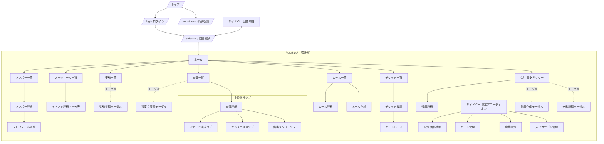

# ChoirHub 画面設計書

**バージョン**: 1.7  
**作成日**: 2026-06-04  
**更新日**: 2026-07-21

---

## 目次

1. [画面一覧・URL設計](#1-画面一覧url設計)
2. [共通レイアウト](#2-共通レイアウト)
3. [認証系画面](#3-認証系画面)
4. [ホーム](#4-ホーム)
5. [メンバー管理](#5-メンバー管理)
6. [スケジュール・出欠](#6-スケジュール出欠)
7. [楽譜管理](#7-楽譜管理)
8. [本番・オンステ管理](#8-本番オンステ管理)
9. [メール](#9-メール)
10. [チケット管理](#10-チケット管理)
11. [会計・費用管理](#11-会計費用管理)
12. [設定](#12-設定)
13. [画面遷移図](#13-画面遷移図)

---

## 1. 画面一覧・URL設計

### 認証系（テナント外）

| 画面名                 | URL                       | 権限         |
| ---------------------- | ------------------------- | ------------ |
| トップ（LP）           | `/`                       | 公開         |
| ログイン               | `/login`                  | 未認証のみ   |
| 招待受諾               | `/invite/[token]`         | 公開         |
| パスワードリセット申請 | `/password-reset`         | 公開         |
| パスワードリセット実行 | `/password-reset/[token]` | 公開         |
| 団体選択               | `/select-org`             | ログイン済み |

### テナント別（`/[org]/` 配下）

| 画面名                           | URL                                            | 権限                                                                               |
| -------------------------------- | ---------------------------------------------- | ---------------------------------------------------------------------------------- |
| ホーム                           | `/[org]`                                       | visitor+（全ロール）                                                               |
| メンバー一覧                     | `/[org]/members`                               | visitor+（visitor は電話・メール非表示）                                           |
| メンバー詳細・自プロフィール編集 | `/[org]/members/[id]`                          | visitor+（自分のプロフィール編集は member+ のみ）                                  |
| 見学申込（承認キュー）           | `/[org]/members/applications`                  | admin                                                                              |
| スケジュール一覧                 | `/[org]/schedule`                              | visitor+                                                                           |
| イベント詳細・出欠表             | `/[org]/schedule/[id]`                         | visitor+                                                                           |
| イベント作成                     | `/[org]/schedule/new`                          | admin, tech                                                                        |
| イベント編集                     | `/[org]/schedule/[id]/edit`                    | admin, tech                                                                        |
| 楽譜一覧                         | `/[org]/scores`                                | visitor+                                                                           |
| 楽譜詳細                         | `/[org]/scores/[scoreId]`                      | visitor+                                                                           |
| 本番一覧                         | `/[org]/concerts`                              | visitor+                                                                           |
| 本番登録                         | `/[org]/concerts/new`                          | admin                                                                              |
| 本番詳細                         | `/[org]/concerts/[id]`                         | visitor+（visitor はステージ構成タブのみ。オンステ調査・出演メンバータブは非表示） |
| メール一覧・作成                 | `/[org]/mailing`                               | member+（visitor はサイドバーのタブ自体が非表示）                                  |
| メール詳細                       | `/[org]/mailing/[id]`                          | member+                                                                            |
| チケット管理（一覧）             | `/[org]/tickets`                               | 権限分岐: ticket/admin→全演奏会管理, member→自分の入力ページ一覧                   |
| チケット集計                     | `/[org]/tickets/[concertId]`                   | ticket_manager, admin                                                              |
| チケット入力（団員）             | `/[org]/tickets/[concertId]/my`                | member+                                                                            |
| パートレース                     | `/[org]/tickets/[concertId]/race`              | ticket_manager, admin（公開後は全員）                                              |
| 情宣活動管理                     | `/[org]/tickets/[concertId]/outreach`          | ticket, admin                                                                      |
| 会計・収支サマリー               | `/[org]/accounting`                            | finance, admin                                                                     |
| 徴収詳細                         | `/[org]/accounting/collections/[collectionId]` | finance, admin                                                                     |
| 設定（団体情報）                 | `/[org]/settings`                              | admin                                                                              |
| パート管理                       | `/[org]/settings/parts`                        | admin                                                                              |
| 会費設定                         | `/[org]/settings/fee`                          | admin                                                                              |
| 支出カテゴリ管理                 | `/[org]/settings/expense-categories`           | admin                                                                              |
| メンバー区分管理                 | `/[org]/settings/member-types`                 | admin                                                                              |
| イベントカテゴリ管理             | `/[org]/settings/event-categories`             | admin                                                                              |
| 見学申込設定                     | `/[org]/settings/visitor-webhook`              | admin                                                                              |

---

## 2. 共通レイアウト

### 2.1 認証後の共通レイアウト（`/[org]/layout.tsx`）

```text
┌─────────────────────────────────────────────┐
│  サイドバー（デスクトップ）/ ボトムナビ（モバイル）   │
├──────────┬──────────────────────────────────┤
│          │  ページヘッダー（タイトル + アクション） │
│  サイド   ├──────────────────────────────────┤
│  バー    │                                  │
│          │  ページコンテンツ                   │
│          │                                  │
└──────────┴──────────────────────────────────┘
```

#### コンテンツ幅

- ページヘッダー（背景・ボーダーは画面幅いっぱいに表示）・ページコンテンツとも、内側のコンテンツ自体は `max-w-7xl`（1280px）+ 中央寄せで幅を制限する（ヘッダー側は内部で `PageBleedRow` を使う `PageHeader`、コンテンツ側は `PageMain` がそれぞれ管理）。ヘッダー＋本文をまとめて扱う単純な画面では `PageWithHeader`（`PageHeader` + `PageMain` + ローディング表示の合成）を使う。
- 1280px未満のビューポートでは実質無効化され、画面幅いっぱいに表示される（モバイル・タブレットでは現状と同じ見た目）。
- 詳細・フォーム系画面（メンバー詳細・メーリス詳細・チケット系の一部）は対象外で、`max-w-lg`〜`max-w-3xl` の個別の幅指定を維持する。

#### サイドバーのナビゲーション項目

```text
┌─────────────────────┐
│  ChoirHub           │
│  男声合唱団A  ∨     │  ← 団体切替ボタン（クリックで /select-org へ）
├─────────────────────┤
│  🏠 ホーム          │
│  ...                │
└─────────────────────┘
```

| アイコン | ラベル                        | リンク先                             | 表示条件                                |
| -------- | ----------------------------- | ------------------------------------ | --------------------------------------- |
| —        | 団体切替ボタン（org名 + `∨`） | `/select-org`                        | 常時                                    |
| Home     | ホーム                        | `/[org]`                             | 全員                                    |
| Users    | メンバー                      | `/[org]/members`                     | visitor+                                |
| Calendar | スケジュール                  | `/[org]/schedule`                    | visitor+                                |
| Music    | 楽譜                          | `/[org]/scores`                      | visitor+                                |
| Star     | 本番                          | `/[org]/concerts`                    | visitor+                                |
| Mail     | メール                        | `/[org]/mailing`                     | visitor以外全員（**visitor は非表示**） |
| Ticket   | チケット                      | `/[org]/tickets`                     | visitor以外全員（**visitor は非表示**） |
| Wallet   | 会計                          | `/[org]/accounting`                  | admin, finance                          |
| Settings | 設定 ▼（アコーディオン）      | —                                    | admin, finance                          |
| —        | └ 団体情報                    | `/[org]/settings`                    | admin                                   |
| —        | └ パート管理                  | `/[org]/settings/parts`              | admin                                   |
| —        | └ 会費設定                    | `/[org]/settings/fee`                | admin, finance                          |
| —        | └ 支出カテゴリ                | `/[org]/settings/expense-categories` | admin, finance                          |
| —        | └ メンバー区分                | `/[org]/settings/member-types`       | admin                                   |
| —        | └ イベント区分                | `/[org]/settings/event-categories`   | admin                                   |

> `visitor` ロールのみの場合（`member` 以上のロールを持たない）、メール・チケットのタブはサイドバーに表示されない。

#### ページヘッダー

- 左: ページタイトル
- 右: 主要アクションボタン（「新規作成」など、権限に応じて表示・非表示）

#### ユーザーメニュー（ヘッダー右上、`UserMenu`）

- アバターボタン（`avatarUrl`があれば円形画像、無ければ氏名の頭文字1文字）をクリックしてドロップダウンを開閉
- ドロップダウン: 氏名表示 → 「プロフィール」（`/[org]/members/:memberId`へ、クリックでメニューを閉じる）→ 「ログアウト」
- 「ログアウト」→ `POST /auth/logout` → 成功・失敗にかかわらず `/login` へ遷移
- メニュー外クリックで自動的に閉じる

#### フッター（コンテンツ下部、`AppFooter`）

- ChoirHubロゴ・「プライバシーポリシー」「利用規約」「お問い合わせ」（現状はいずれもリンク未実装のプレースホルダー）・コピーライト表記

### 2.2 モバイル対応

- 画面幅1024px未満では、サイドバーは初期状態で非表示。ヘッダー左のハンバーガーボタン（`AppShell`）をタップすると同じサイドバーがオーバーレイのスライドインドロワーとして表示される（項目を絞った専用のボトムナビゲーションは無い）
- ドロワー表示中は背景に半透明の黒オーバーレイが出現し、タップまたはサイドバー右上の`×`ボタンで閉じる
- ドロワー内のリンクをタップして画面遷移すると自動的に閉じる
- 画面幅1024px以上ではサイドバーは常時表示の固定パネルになり、ハンバーガーボタン・オーバーレイは機能しない

---

## 3. 認証系画面

### 3.1 トップ（LP）`/`

**目的**: 未ログインユーザーへの紹介とログイン誘導

#### レイアウト

- ヘッダー: ロゴ + ログインボタン
- ヒーロー: キャッチコピー + 「ログイン」ボタン
- フィーチャー: 主要機能の紹介（3〜4項目）
- フッター

---

### 3.2 ログイン `/login`

**目的**: メールアドレス・パスワードによる認証

#### レイアウト

```text
┌─────────────────────────┐
│     ChoirHub ロゴ        │
│                         │
│  メールアドレス           │
│  [___________________]  │
│                         │
│  パスワード              │
│  [___________________]  │
│                         │
│  [    ログイン    ]      │
│                         │
│  パスワードをお忘れですか？│ ← /password-reset へ
└─────────────────────────┘
```

#### インタラクション

- メールアドレス・パスワードのバリデーション（メール形式・パスワード未入力）はクライアント側で即時表示
- ログイン成功 → `/select-org`（団体選択画面）へリダイレクト
- エラー（401） → 「メールアドレスまたはパスワードが正しくありません」（どちらが間違いか明示しない）
- エラー（401以外） → 「ログインに失敗しました。しばらく後でお試しください。」
- 「パスワードをお忘れですか？」→ パスワードリセット申請（3.5）

---

### 3.3 団体選択 `/select-org`

**目的**: ログイン後にアクセスする団体を選ぶ（1団体のみの場合も必ず経由する）

**表示条件**: ログイン済みユーザー全員がアクセス可能

#### レイアウト

```text
┌──────────────────────────────────────┐
│     ChoirHub ロゴ                     │
│  山田 太郎 さん、ようこそ              │
├──────────────────────────────────────┤
│  所属団体を選択                       │
│  ┌────────────────────────────────┐  │
│  │(A)男声合唱団A                  │  │
│  │  Tenor I ・● 在団 ・技術系      │→│
│  └────────────────────────────────┘  │
│  ┌────────────────────────────────┐  │
│  │(混)混声合唱団B                 │  │
│  │  Bass ・● 休団                 │→│
│  └────────────────────────────────┘  │
└──────────────────────────────────────┘
│  ＋ 新しい団体を作成                  │
│                                        │
│  別のアカウントでログインする場合は     │
│  ログアウト                           │
```

所属団体が0件の場合はリストの代わりに空状態を表示する。

```text
┌──────────────────────────────────────┐
│      所属している団体がありません      │
│  退団処理された可能性があります。      │
│  団体の管理者にお問い合わせください。  │
└──────────────────────────────────────┘
```

「新しい団体を作成」を開くと以下のインラインフォームが表示される。

```text
┌──────────────────────────────────────┐
│  新しい団体を作成              [×]    │
│  団体名                              │
│  [___________________________]       │
│  スラグ（URL に使用）                 │
│  choirhub.app/[_________________]     │
│  [        作成する        ]          │
└──────────────────────────────────────┘
```

#### インタラクション

- 画面表示時に自身の所属団体一覧を取得。未ログイン（401） → `/login` へ自動リダイレクト。それ以外のエラー（500等） → 「団体情報の取得に失敗しました。しばらくしてから再度お試しください。」を表示（0件時の空状態とは別メッセージ）
- 団体カード: アバター文字（団体名の頭文字）・団体名・パート名（所属パートがある場合）・在団状況（在団＝緑ドット／休団＝黄ドット／それ以外＝グレードットで生のステータス値を表示）・`member`以外のロール（技術系・楽譜がかり等）を表示
- 団体カードをクリック → `/{orgSlug}` へ遷移
- 所属団体が0件の場合は「所属している団体がありません」という空状態を表示（団体カード一覧の代わり）
- 「新しい団体を作成」→ インラインフォームを展開（団体名・スラグを入力）。スラグは団体名から自動生成されるが、手動編集も可能（一度編集すると自動生成には戻らない）
  - 作成成功 → `/{orgSlug}` へ遷移
  - エラー（409：スラグ重複） → 「このスラグはすでに使用されています」
  - エラー（409以外） → 「作成に失敗しました。しばらくしてから再試行してください」
  - `[×]` ボタンでフォームを閉じる
- 「ログアウト」→ ログアウトAPIを呼び出し `/login` へ遷移

---

### 3.4 招待受諾 `/invite/[token]`

**目的**: 招待リンクを通じた新規メンバー登録

#### レイアウト

```text
┌─────────────────────────┐
│     ChoirHub ロゴ        │
│                         │
│  ○○合唱団 への参加登録   │
│  user@example.com       │
│                         │
│  お名前                 │
│  [___________________]  │
│                         │
│  パスワード（8文字以上） │
│  [_________________👁]  │
│                         │
│  パスワード（確認）      │
│  [___________________]  │
│                         │
│  [   登録する   ]        │
└─────────────────────────┘
```

登録完了後は同じカード内が以下の完了画面に切り替わる。

```text
┌─────────────────────────┐
│           ✓             │
│     登録が完了しました    │
│  ○○合唱団 へようこそ！   │
│ ログインページからサインイン│
│  してください。           │
│                         │
│  [ ログインページへ ]     │
└─────────────────────────┘
```

#### インタラクション

- トークン無効・期限切れ → 「招待リンクが無効または期限切れです。管理者に再発行を依頼してください。」を表示（フォームは表示しない）
- 招待情報取得中はローディングスピナーを表示
- パスワード欄は目アイコンで表示・非表示を切り替え可能（`パスワードを表示する`/`パスワードを隠す`）
- お名前未入力・パスワード8文字未満・パスワード（確認）不一致はクライアント側で即時バリデーションエラーを表示
- 登録成功 → カード内が完了画面に切り替わる。「ログインページへ」ボタンをクリックすると `/login` へ遷移（自動リダイレクトはしない）
- エラー（409：登録済み） → 「このメールアドレスはすでに登録済みです。ログインページからログインしてください。」
- エラー（409以外） → 「登録に失敗しました。もう一度お試しください。」

---

### 3.5 パスワードリセット申請 `/password-reset`

**目的**: パスワードを忘れたユーザーがリセットメールを申請する

#### レイアウト

```text
┌─────────────────────────┐
│     ChoirHub ロゴ        │
│                         │
│  パスワードをお忘れですか？│
│  登録済みのメールアドレス  │
│  を入力してください。      │
│                         │
│  メールアドレス           │
│  [___________________]  │
│                         │
│  [ リセットメールを送信 ] │
│                         │
│  ログインページへ戻る      │ ← /login へ
└─────────────────────────┘
```

送信成功後は同じカード内が以下の完了画面に切り替わる。

```text
┌─────────────────────────┐
│           ✓             │
│   メールを送信しました    │
│ パスワードリセット用の     │
│ リンクをお送りしました。   │
│ 受信ボックスをご確認ください│
│（リンクの有効期限は1時間） │
│                         │
│  [ ログインページへ ]     │
└─────────────────────────┘
```

#### インタラクション

- メール形式が不正な場合はクライアント側で即時バリデーションエラーを表示
- 送信成功 → メールアドレスの存在有無に関わらずカード内が完了画面に切り替わる（「ログインページへ」リンクで `/login` へ遷移）
- エラー → 「送信に失敗しました。しばらく後でお試しください。」（ステータスコードによる出し分けなし）
- 「ログインページへ戻る」→ `/login`

---

### 3.6 パスワードリセット実行 `/password-reset/[token]`

**目的**: 申請したリンクから新しいパスワードを設定する

#### レイアウト

```text
┌─────────────────────────┐
│     ChoirHub ロゴ        │
│                         │
│  新しいパスワードを設定    │
│  user@example.com       │
│                         │
│  新しいパスワード（8文字以上）│
│  [_________________👁]  │
│                         │
│  パスワード（確認）        │
│  [___________________]  │
│                         │
│  [ パスワードを変更する ] │
└─────────────────────────┘
```

トークン検証中はローディングスピナー、変更完了後は以下の完了画面に切り替わる。

```text
┌─────────────────────────┐
│           ✓             │
│ パスワードを変更しました   │
│新しいパスワードでログイン  │
│してください。             │
│                         │
│  [ ログインページへ ]     │
└─────────────────────────┘
```

トークンが無効・期限切れの場合はエラーカードのみを表示する。

```text
┌─────────────────────────┐
│ リンクが無効または期限切れ │
│ です。もう一度パスワード   │
│ リセットを申請してください。│
│                         │
│  [    再申請する    ]     │
└─────────────────────────┘
```

#### インタラクション

- ページ表示時にトークンを検証し、メールアドレスを取得
- トークン無効・期限切れ → 「リンクが無効または期限切れです。もう一度パスワードリセットを申請してください。」+「再申請する」ボタン（`/password-reset` へ）
- トークン検証中はローディングスピナーを表示
- パスワード欄は目アイコンで表示・非表示を切り替え可能（`パスワードを表示する`/`パスワードを隠す`）
- パスワード8文字未満・パスワード（確認）不一致はクライアント側で即時バリデーションエラーを表示
- 変更成功 → カード内が完了画面に切り替わる。「ログインページへ」ボタンをクリックすると `/login` へ遷移（自動リダイレクトはしない）
- エラー（404：トークン無効） → 「リンクが無効または期限切れです。もう一度申請してください。」
- エラー（404以外） → 「パスワードの変更に失敗しました。しばらく後でお試しください。」

---

## 4. ホーム

### `/[org]`

**目的**: ログイン後の起点。団の現状と自分のアクションを一目で把握する

#### レイアウト

```text
┌──────────────────────────────────────────┐
│  ホーム              [⚠ 出欠未回答 2件]    │
├──────────────────────────────────────────┤
│  ┌──────────┐ ┌──────────┐ ┌──────────┐  │
│  │次回練習まで│ │次回本番まで│ │今月の幹事 │  │
│  │  3日      │ │  45日     │ │ Tenor I  │  │
│  │第12回定期練習│ │第20回定期演奏会│ │【ticket+ │  │
│  │           │ │           │ │ のみ✎編集】│  │
│  └──────────┘ └──────────┘ └──────────┘  │
├──────────────────────────────────────────┤
│  直近の予定                    [すべて見る] │
│  ┃6/10（火）18:30〜  第12回定期練習         │
│  ┃ ○○公民館            ● 未回答            │
│  ┃6/17（火）18:30〜  第13回定期練習         │
│  ┃ ○○公民館            ● 参加              │
├──────────────────────────────────────────┤
│  最近のメール                  [すべて見る] │
│  [花]  幹事 花子   6月練習のご案内   5/30  │
│  [事]  事務 一郎   定演について      5/25  │
└──────────────────────────────────────────┘
```

> メール行の送信者アバターは画像があれば円形画像、無ければ頭文字を表示する。

#### カード・セクションの表示条件

| 項目                      | 条件                                                                                                                                 |
| ------------------------- | ------------------------------------------------------------------------------------------------------------------------------------ |
| 次回練習まで/次回本番まで | 該当イベントが無い場合は「予定なし」を表示                                                                                           |
| 今月の幹事                | `ticket`または`admin`のみ鉛筆アイコンで編集可。未設定時は「未設定」をグレー表示                                                      |
| 直近の予定                | 表示対象イベント（`admin`は全件、それ以外は`targetRoles`/`targetPartIds`でフィルタ）のうち直近3件。0件時は「直近の予定はありません」 |
| 最近のメール              | `visitor`ロールの場合、または0件の場合はセクション自体を非表示                                                                       |

#### インタラクション

- イベントカードをクリック
  - 通常のイベント（`concertId`が無い） → `/[org]/schedule/[id]`（出欠表）
  - 本番に紐づくイベント（`concertId`あり） → `/[org]/concerts/[concertId]?tab=stages&from=home`
- 直近メールをクリック → `/[org]/mailing/[id]`
- 「出欠未回答」バッジをクリック
  - 未回答が1件かつ直近の予定（上記3件）内に含まれる場合 → そのイベント詳細（`/[org]/schedule/[id]`）へ直接遷移
  - 未回答が2件以上、または該当イベントが直近の予定に含まれない場合 → `/[org]/schedule`（一覧）へ遷移
- 「今月の幹事」の鉛筆アイコンをクリック → その場でパート名を編集（Enter保存 / Escapeキャンセル）

---

## 5. メンバー管理

### 5.1 メンバー一覧 `/[org]/members`

**目的**: 団員の一覧確認とフィルタリング

#### レイアウト

```text
┌─────────────────────────────────────────────────────┐
│  メンバー      [見学申込 3] [見学者を追加] [+ メンバーを招待]│
├─────────────────────────────────────────────────────┤
│  ステータス▼ 区分▼  12名        並び順▼  [⊞][☰]     │
├─────────────────────────────────────────────────────┤
│  Tenor I  4名 ────────────────────────────────────── │
│  ┌──────┐ ┌──────┐ ┌──────┐ ┌──────┐               │
│  │ 顔写真│ │ 顔写真│ │ 顔写真│ │ 顔写真│               │
│  │ 山田  │ │ 田中  │ │ 佐藤  │ │ 鈴木  │               │
│  └──────┘ └──────┘ └──────┘ └──────┘               │
│  パート未設定  1名 ─────────────────────────────────── │
│  ┌──────┐                                            │
│  │ 顔写真│                                            │
│  └──────┘                                            │
└─────────────────────────────────────────────────────┘
```

> `guest` / `visitor` ロールのアカウントはこの一覧に表示されない。パートごとにグルーピングされ、各グループ見出しの右に人数を表示する。

#### フィルタ・並び替え

| 項目         | 選択肢                                                               |
| ------------ | -------------------------------------------------------------------- |
| ステータス   | 全員 / 在団（`active`・デフォルト） / 休団（`offstage`）             |
| メンバー区分 | 全区分（デフォルト） / 各区分 / 未設定（区分自体が0件なら非表示）    |
| 並び順       | 名前順（デフォルト、フリガナ優先） / 在籍歴が長い順 / 入団が新しい順 |

#### 表示モード

- カード表示（デフォルト）: 顔写真・名前・パート・在籍年数のサムネイル一覧
- リスト表示: 名前・パート・ロール・入団日・ステータスの行一覧
- 画面幅が`sm`未満（モバイル）では、表示モードの選択に関わらず常にカード表示になる

#### 表示状態

| 状態                                       | 表示                           |
| ------------------------------------------ | ------------------------------ |
| 取得中                                     | 「読み込み中...」              |
| 取得エラー                                 | エラーメッセージ               |
| フィルタ後0件、かつ組織にパートも1つも無い | 「該当するメンバーがいません」 |
| フィルタ後0件だが組織にパートは存在する    | 各パートの0名セクションが並ぶ  |

#### インタラクション

- カード/行クリック → `/[org]/members/[id]`
- `admin` のみ: 「メンバーを招待」ボタン → 招待モーダル
- `admin` のみ: 「見学申込」ボタン → `/[org]/members/applications`（保留中の件数をバッジ表示）
- `member+`: 「見学者を追加」ボタン → 見学者追加モーダル

**招待モーダル**（admin のみ）

```text
┌──────────────────────────┐
│  メンバーを招待       [×] │
│  お名前（任意）            │
│  [______________________]│
│  メールアドレス *          │
│  [______________________]│
│  パート                   │
│  [未設定             ▼] │
│  ロール * （複数選択可）    │
│  [member][tech][score]... │
│  [招待メールを送信][キャンセル]│
└──────────────────────────┘
```

- メールアドレスが既に団体に登録済みの場合はエラーメッセージを表示する
- 送信成功 → 招待モーダルを閉じ、「招待メールを送信しました」モーダルを表示する

**見学者追加モーダル**（member+）

```text
┌──────────────────────────┐
│  見学者を追加         [×] │
│  お名前 *                 │
│  [______________________]│
│  希望パート                │
│  [未定               ▼] │
│  出身団体                  │
│  [______________________]│
│  連絡先                   │
│  [______________________]│
│  コメント                  │
│  [______________________]│
│  [登録する][キャンセル]     │
└──────────────────────────┘
```

- 希望パートはその団体の Part 一覧（`GET /parts`）からのプルダウン選択（自由入力不可）。未選択時は「未定」
- Member/User アカウントは作成されない。見学申込として記録され、admin へ通知メールが送られる
- 登録成功 → モーダルを閉じ、「見学申込を登録しました」モーダルを表示する

---

### 5.2 メンバー詳細 `/[org]/members/[id]`

**目的**: 団員の詳細プロフィール閲覧

#### レイアウト

```text
┌─────────────────────────────────────────────┐
│  [顔写真]  山田 太郎                          │
│           Tenor I  ｜ active  ｜ 3年在籍     │
│           [管理者] [技術系]                   │
│  ひとこと: よろしくお願いします               │
├─────────────────────────────────────────────┤
│  職業         エンジニア                      │
│  好きなもの   コーヒー                        │
│  出身団体     ○○大学合唱団                   │
│  入団日       2020年4月入団                   │
│  【member+ のみ表示】                         │
│  メールアドレス  xxx@example.com              │
│  電話番号        090-xxxx-xxxx               │
│  【admin のみ表示】                           │
│  管理者メモ   ...                             │
├─────────────────────────────────────────────┤
│  【admin のみ表示・管理者操作パネル】           │
│  ロール / パート / ステータス / 電話 / メモ    │
└─────────────────────────────────────────────┘
```

#### 権限による表示制御

| 項目                     | guest / visitor | member+ | admin |
| ------------------------ | --------------- | ------- | ----- |
| 基本プロフィール         | ✅              | ✅      | ✅    |
| メールアドレス・電話番号 | ❌              | ✅      | ✅    |
| 管理者メモ               | ❌              | ❌      | ✅    |
| 管理者操作パネル         | ❌              | ❌      | ✅    |

#### インタラクション

- 自分のプロフィール閲覧時 → ヘッダーに「編集」ボタン表示
- `admin` のみ（他者閲覧時）: 管理者操作パネルを表示
  - ロール（`member`は常に付与されるため選択肢に含まれない）・パート・ステータス・メンバー区分・管理者メモを変更し「変更を保存」→ 一覧（変更後のステータスで絞り込み）へ遷移
  - 「退団処理」→ 確認ダイアログ→OKでソフトデリート（`deletedAt`セット）→ 一覧へ遷移

---

### 5.3 プロフィール編集 `/[org]/members/[id]`（インライン）

**目的**: 自分のプロフィール情報を更新する（詳細ページ内インラインフォーム）

#### フォームフィールド

| フィールド     | 入力形式             | 備考                                                                                                       |
| -------------- | -------------------- | ---------------------------------------------------------------------------------------------------------- |
| 顔写真         | ファイルアップロード | JPEG/PNG/WebP/GIF、4MB以内                                                                                 |
| 氏名（日本語） | テキスト             | 必須                                                                                                       |
| カナ           | テキスト             | 任意                                                                                                       |
| ひとこと       | テキストエリア       | 全員閲覧可・200文字以内（カウンター表示）                                                                  |
| 職業           | テキスト             | 任意                                                                                                       |
| 好きなもの     | テキスト             | 任意                                                                                                       |
| 出身団体       | テキスト             | 任意                                                                                                       |
| メールアドレス | テキスト（email）    | 本人のみ編集可。[将来対応](https://github.com/Genki1019/choirhub/issues/105)でログイン確認フローに変更予定 |
| 電話番号       | テキスト（tel）      | member+ のみ閲覧・本人のみ編集可                                                                           |

#### インタラクション

- 保存 → 詳細ページへ戻る（同一 URL 内）
- 顔写真アップロード → 選択直後にクライアント側でプレビューを切り替え、即座にアップロードを送信する（プロフィール本体の保存とは独立）
- 顔写真アップロード失敗 → エラーメッセージを表示し、プレビューを元のアバターに戻す

---

### 5.4 見学申込 `/[org]/members/applications`（admin）

**目的**: 見学申込（手入力・Googleフォーム経由）を確認し、承認・却下する承認キュー画面

#### レイアウト

```text
┌─────────────────────────────────────────────┐
│  ← 見学申込          [選択した2件を一括承認]  │
├─────────────────────────────────────────────┤
│  ☐ 見学 太郎  [手入力]                       │
│    希望パート: テノール / 出身団体: ○○大学   │
│    [承認] [却下]                             │
│  ☐ 見学 花子  [Googleフォーム]                │
│    [承認] [却下]                             │
└─────────────────────────────────────────────┘
```

> `admin` 以外がアクセスした場合はメンバー一覧へリダイレクトされる。

#### インタラクション

- チェックボックスで複数選択 → ヘッダーに「選択した◯件を一括承認」ボタンが出現
- 各行の「承認」「却下」→ 該当行を一覧から除去
- 承認（個別・一括いずれも）後、案内パネルを表示

```text
┌─────────────────────────────────────────────┐
│  承認しました。団員へ共有しますか？        [×]│
│  画面を移動してもこの案内は消えません。      │
│  団員へ共有し終えたら「閉じる」を押してください│
│  [今すぐ紹介メールを送る] [テキストをコピーする]│
└─────────────────────────────────────────────┘
```

- 「今すぐ紹介メールを送る」→ `/[org]/mailing` のメール作成モーダル（[9.2](#92-メール作成composemodal--orgmailing-上のモーダル)）を、対象者の氏名・希望パート・出身団体をまとめた件名・本文で事前入力した状態・宛先「全員」で開く
- 「テキストをコピーする」→ 紹介文をクリップボードにコピーする（他のメール文面に貼り付けて利用する想定）。コピーしただけでは団員へのメールは送信されない
- この案内パネルはセッション中（ブラウザのタブを閉じるまで）保持され、他画面へ移動して戻ってきても消えない。［×］を押すか、実際にメールを送信するまで表示され続ける

---

## 6. スケジュール・出欠

### 6.1 スケジュール一覧 `/[org]/schedule`

**目的**: 月単位でイベントを確認する

#### レイアウト

```text
┌──────────────────────────────────────────────┐
│  ← 2026年6月 →                [イベント追加]  │
├───┬───┬───┬───┬───┬───┬──────────────────────┤
│ 日 │ 月 │ 火 │ 水 │ 木 │ 金 │ 土              │
├───┼───┼───┼───┼───┼───┼──────────────────────┤
│   │   │   │   │ 4 │ 5 │ 6                    │
├───┼───┼───┼───┼───┼───┼──────────────────────┤
│ 7 │ 8 │ 9 │10 │11 │12 │13                    │
│   │   │   │[練習 ○]│  │  │                   │
└───┴───┴───┴───┴───┴───┴──────────────────────┘

📅 6月の予定
┌──────────────────────────────────────────────┐
│ ▌ 6/10（火）19:00〜                          │
│   第12回合同練習                         〇  │
└──────────────────────────────────────────────┘
```

#### カレンダーセルのイベント表示

| 画面幅                 | 表示形式                                               |
| ---------------------- | ------------------------------------------------------ |
| モバイル（sm未満）     | カテゴリ色背景のタイトルチップ（文字数はセル幅に依存） |
| デスクトップ（sm以上） | カテゴリ色背景のタイトルチップ ＋ 出欠記号（○△✕—）     |

#### N月の予定リスト（カレンダー下）

表示中の月の今日以降のイベントを日付昇順で一覧表示する。

| 表示月       | 表示内容                              | 空の場合のメッセージ     |
| ------------ | ------------------------------------- | ------------------------ |
| 今月・過去月 | 今日以降のイベント（過去月は常に0件） | 予定はすべて終了しました |
| 来月以降     | その月の全件                          | 予定はありません         |

#### インタラクション

- イベントチップクリック → `/[org]/schedule/[id]`
- 月ナビゲーション: 前月・次月ボタン（予定リストも連動して切り替わる）
- 「イベント追加」ボタン（`admin`/`tech`/`conductor`） → `/[org]/schedule/new`（専用ページ）

**イベント作成ページ** `/[org]/schedule/new`（`admin`/`tech`/`conductor`）

| フィールド         | 入力形式                              | 必須 | 備考                                   |
| ------------------ | ------------------------------------- | ---- | -------------------------------------- |
| タイトル           | テキスト                              | ✅   | autoFocus                              |
| 種別               | トグルチップ（練習/本番/会議/その他） | ✅   | デフォルト: 練習                       |
| 開始日時           | 日付ピッカー + 時刻ピッカー           | ✅   | デフォルト: 今日 / 18:00               |
| 終了日時           | 日付ピッカー + 時刻ピッカー           | ✅   | デフォルト: 今日 / 22:00               |
| 場所               | LocationSearch（オートコンプリート）  |      | Google Places API / Nominatim fallback |
| 招待対象           | トグルチップ（役職・パート）          |      | 未選択 = 全員                          |
| 出欠締切           | トグル + 日時ピッカー                 |      |                                        |
| 練習曲の内容       | テキストエリア                        |      |                                        |
| タイムスケジュール | テキストエリア                        |      |                                        |
| 練習会場           | テキストエリア                        |      | 「場所」フィールドとは別の補足自由記述 |
| その他備考         | テキストエリア                        |      |                                        |

> **場所フィールド**: テキスト入力で候補がサジェストされ、選択するとGoogle MapsリンクURLも自動保存される。`/api/places` Route Handler 経由でサーバーサイドプロキシ。

---

### 6.2 イベント詳細・出欠表 `/[org]/schedule/[id]`

**目的**: 伝助ライクな出欠表でイベントの参加状況を確認・回答する

#### レイアウト

```text
┌─────────────────────────────────────────────────┐
│  第12回定期練習                    [編集][削除]  │
│  2026/6/10（火）18:30〜21:00 ○○公民館           │
│  出欠締切: 6/8（日）23:59                        │
├─────────────────────────────────────────────────┤
│  練習曲の内容                                    │
│  新曲『○○』の初見合わせ                          │
│  タイムスケジュール                              │
│  18:00 集合 / 18:15 発声 / 19:00 パート練習      │
├──────────────────┬────────┬────────────────────┤
│  名前             │  出欠  │  メモ               │
├──────────────────┼────────┼────────────────────┤
│  Tenor I  ○4 △1 ✕1 ──────────────────────────  │
│  山田 太郎        │  [○]  │                    │
│  田中 次郎（自分）│  [△]  │ 19:00着 / 遅れます  │
│  佐藤 三郎        │  [✕]  │                    │
├──────────────────┼────────┼────────────────────┤
│  Bass  ○8 △0 ✕0 ───────────────────────────── │
│  鈴木 四郎        │  [　] │                    │
├──────────────────┼────────┼────────────────────┤
│  集計             │ ○12 △3 ✕4 —5              │
└──────────────────┴────────┴────────────────────┘
```

> `guest` / `visitor` ロールのアカウントはこの出欠表の行（メンバー一覧）に表示されない。自身の出欠回答は可能。パートごとの見出し行に、そのパートの○△✕件数を表示する。
> 備考カード（練習曲の内容・タイムスケジュール・練習会場・その他備考）は値が入っている項目のみ表示され、4項目すべて未入力の場合はカード自体が非表示になる。

#### インタラクション

- 自分の行の出欠セル → クリックで ○ / ✕ / △ / — を順に切り替え（ローカルで即時反映 → API送信、失敗時はロールバック）
- △ を選択時 → 行内にインライン入力欄が展開（到着時刻・退席時刻・メモ）。明示的に「保存」ボタンを押すまで送信されない
- 到着時刻・退席時刻・メモのいずれかが登録済みの行 → セル横に要約テキストを常時表示（例: `19:00着 / 遅れます`）。「詳細を編集」クリックで再度入力欄を展開できる
- `isLocked: true`（締切後） → セルは表示のみ・編集不可
- `admin`/`tech`/`conductor` のみ: 「編集」ボタン → `/[org]/schedule/[id]/edit`（専用ページ）
- `admin`/`tech`/`conductor` のみ: 「削除」ボタン → 確認モーダル→OKで削除しイベント一覧へ遷移

#### 出欠セル操作フロー

```text
セルをクリック
  → 現在 undecided → attending に変更
  → 現在 attending → absent に変更
  → 現在 absent → maybe に変更
  → 現在 maybe → undecided に変更

△（maybe）選択後:
  → 遅刻/早退/メモ入力欄が行内に展開
  → 入力して明示的に「保存」ボタンを押す（自動保存は無い）
```

---

## 7. 楽譜管理

### 7.1 楽譜一覧 `/[org]/scores`

**目的**: 団の楽譜一覧を演奏会別に確認し、楽譜詳細ページへ遷移する。

**レイアウト**（演奏会別アコーディオン）

```text
┌──────────────────────────────────────────────────────┐
│  楽譜                    2曲       [曲目を追加]        │
│                                   （admin のみ）       │
├──────────────────────────────────────────────────────┤
│  ▼ 第20回定期演奏会（2026/11/23・○○ホール・3曲）      │
│  ├─ 第1ステージ                                       │
│  │   📖 男声合唱のための〇〇  作曲:△△             ›  │
│  │   📖 男声合唱のための□□  作曲:◇◇             ›  │
│  └─ 第2ステージ                                       │
│      📖 ××組曲  作曲:○○                          ›  │
│                                                      │
│  ▼ 演奏会未定  1曲                                    │
│      📖 □□の詩  作曲:◇◇                          ›  │
└──────────────────────────────────────────────────────┘
```

#### 各スコア行の要素

| 要素                        | 表示条件                                      |
| --------------------------- | --------------------------------------------- |
| 曲名・作曲者/編曲者         | 全員                                          |
| 詳細ページへのリンク（`›`） | 全員（クリックで `/scores/[scoreId]` へ遷移） |

> ファイルアクセス・価格・管理操作はすべて楽譜詳細ページに集約。一覧は曲目の確認とナビゲーションのみ担う。

---

### 7.2 楽譜登録モーダル

**目的**: 新規楽譜を登録する（楽譜一覧ページ内モーダル）

**表示条件**: admin のみ「曲目を追加」ボタンが表示される

#### フォームフィールド

| フィールド             | 入力形式             | 必須 |
| ---------------------- | -------------------- | ---- |
| 曲名                   | テキスト             | ✅   |
| 作曲者                 | テキスト             |      |
| 編曲者                 | テキスト             |      |
| 委嘱作品               | チェックボックス     |      |
| 購入日                 | 日付                 |      |
| 配布開始日             | 日付                 |      |
| 仕入価格（円）         | 数値                 |      |
| 備考                   | テキストエリア       |      |
| ステージに追加（任意） | 演奏会・ステージ選択 |      |

#### インタラクション

- 保存 → モーダルを閉じ、ステージ指定あり→一覧リロード / なし→演奏会未定セクションに追加
- 同じ曲名・作曲者の楽譜が既に存在する場合、警告バナーを表示して一時停止する
  - 「それでも追加する」を押すと重複を許容して登録（男声版・混声版など意図的な重複に対応）
  - 曲名または作曲者を変更すると警告はリセットされる
- ファイルアップロードは登録後に楽譜詳細画面のファイル管理から行う

---

### 7.3 楽譜詳細 `/[org]/scores/[scoreId]`

**目的**: 楽譜のファイル閲覧・詳細情報確認・管理操作を一画面に集約する。

#### レイアウト

```text
┌──────────────────────────────────────────────────────┐
│  ← 楽譜一覧へ                             [編集]     │
│  男声合唱のための〇〇                               │
│  △△ 作曲 / □□ 編曲                              │
├──────────────────────────────────────────────────────┤
│  ファイル                                            │
│  [📄 楽譜PDF]  [🎵 MIDI 3件]                        │
│  （canAccessFiles: false の場合は制限メッセージ）    │
├──────────────────────────────────────────────────────┤
│  詳細情報                                            │
│  委嘱      委嘱作品                                  │
│  購入日    2026-10-01                               │
│  配布開始日 2026-10-15                              │
│  配布価格  ¥500  [✏️]   （member+ に表示）          │
│  仕入価格  ¥1,200        （score+ のみ）             │
│  購入者    20名  [管理]  （score+ のみ）              │
│  備考      初版                                     │
├──────────────────────────────────────────────────────┤
│  管理  （isFileManager = score+/tech+/conductor のみ）│
│  [ファイル管理]  [+ 徴収を作成] or [✅ 徴収作成済み] │
└──────────────────────────────────────────────────────┘
```

#### セクション別表示条件

| セクション / 要素     | 表示条件                                           |
| --------------------- | -------------------------------------------------- |
| ファイルリンク（PDF） | `canAccessFiles: true`                             |
| MIDI ボタン           | `canDownload: true`                                |
| 配布価格行            | `member+`（MEMBER_LEVEL_ROLES）                    |
| 価格編集ボタン（✏️）  | `score+`（admin / score）                          |
| 仕入価格行            | `score+`                                           |
| 購入者数・管理リンク  | `score+`                                           |
| 管理セクション全体    | `isFileManager`（score+ または tech+ / conductor） |
| 徴収を作成ボタン      | `score+` かつ `distributionPrice` が設定済み       |
| 徴収作成済みバッジ    | `score+` かつ `hasCollection: true`                |
| 編集ボタン            | `score+`                                           |

**配布価格のインライン編集**（score+）

- 価格バッジ横の ✏️ → 数値入力フィールドに切り替え
- Enter または フォーカスアウト → 保存（PATCH `/scores/:id/price`）
- Escape → キャンセル

**楽譜情報編集モーダル**（score+）

- admin は曲名・作曲者・編曲者も編集可
- 全 score+ が編集可: 委嘱フラグ・購入日・配布開始日・仕入価格・備考
- アクセスレベルはモーダルに表示しない（運用方針: 全楽譜を `restricted` として扱い、価格=0・全員購入記録で「全員閲覧可」を表現）

**ファイル管理モーダル**（isFileManager）

| セクション | 内容                                                             | 削除可否                             |
| ---------- | ---------------------------------------------------------------- | ------------------------------------ |
| 楽譜 (PDF) | `full_score` ファイル（未分類扱いの旧データ含む）                | `canManagePdf`（score+）             |
| MIDI       | `midi` ファイル。パート別にグループ表示（全体 → 各パート50音順） | `canManageMidi`（tech+ / conductor） |
| その他     | 上記2種以外の全ファイル（`other`・`part_score`・`audio` 等）     | `canManagePdf`（score+）             |

- 楽譜 (PDF) はアップロード種別選択に1件のみ登録可能。既に登録済みの場合は選択肢から外れ、警告バナーで差し替え手順を案内
- MIDI アップロード時のみパート選択欄（全体 or 各パート）を表示
- 削除は確認ダイアログを挟んでから実行

**MIDI再生モーダル**（`canDownload: true` の場合にファイルセクションから起動）

- パート別にグループ表示（全体 → 各パート50音順）。同一パート内に複数ファイルがある場合は `1/2` 等の件数ラベルを付与
- 再生ボタン → インライン `<audio>` を展開・再生（`downloadUrl` 未設定時はデモ音源にフォールバック）
- ダウンロードリンクは `downloadUrl` を使用

**購入者記録モーダル**（score+）

- 在籍中メンバーをパート別（50音順、パート未設定は最後）にチェックボックス一覧表示。既存の購入記録を初期チェック状態に反映
- 保存 → PUT `/scores/:id/purchases` で選択メンバーIDを一括更新

---

## 8. 本番・オンステ管理

### 8.1 本番一覧 `/[org]/concerts`

**目的**: 演奏会の一覧確認

**レイアウト**（カード表示）

```text
┌──────────────────────────────────────────────────┐
│  本番一覧                         [演奏会を登録]  │
│                                  （admin のみ）  │
├──────────────────────────────────────────────────┤
│  ┌────────────────────────────────────────────┐  │
│  │  第20回定期演奏会                          │  │
│  │  2026/11/23（月・祝）○○ホール             │  │
│  │  [調査中]  3ステージ · 12曲               │  │
│  └────────────────────────────────────────────┘  │
│  ┌────────────────────────────────────────────┐  │
│  │  第19回定期演奏会                          │  │
│  │  2025/11/22  ○○ホール                    │  │
│  │  [終了]   2ステージ · 8曲                 │  │
│  └────────────────────────────────────────────┘  │
└──────────────────────────────────────────────────┘
```

#### ステータス表示

| status      | 表示     | バッジ色 |
| ----------- | -------- | -------- |
| draft       | 準備中   | グレー   |
| survey_open | 調査中   | 黄       |
| confirmed   | 確定済み | 緑       |
| past        | 終了     | グレー   |

#### インタラクション

- カードクリック → `/[org]/concerts/[id]`
- 「演奏会を登録」ボタン（admin のみ）→ `/[org]/concerts/new`（専用ページ）

**演奏会登録ページ** `/[org]/concerts/new`（admin のみ）

| フィールド | 入力形式                             | 必須 | 備考                                  |
| ---------- | ------------------------------------ | ---- | ------------------------------------- |
| 演奏会名   | テキスト                             | ✅   | autoFocus                             |
| 種別表示   | 固定「本番」チップ（変更不可）       | —    | スケジュール新規ページと統一          |
| 開始日時   | 日付ピッカー + 時刻ピッカー          | ✅   | デフォルト: 今日 / 18:00              |
| 終了日時   | 日付ピッカー + 時刻ピッカー          | ✅   | デフォルト: 今日 / 22:00              |
| 会場       | LocationSearch（オートコンプリート） |      | 会場名から Google Maps URL を自動生成 |
| 招待対象   | トグルチップ（役職・パート）         |      |                                       |
| 出欠締切   | トグル + 日時ピッカー                |      |                                       |
| 全体備考   | テキストエリア                       |      |                                       |

---

### 8.2 本番詳細 `/[org]/concerts/[id]`

**目的**: ステージ構成・演目・オンステ確定状況の確認と管理（ステージ構成・演目編集は admin のみ、オンステ調査・フォーメーション編集は tech 以上）

> `visitor` ロールのみの場合はステージ構成タブのみ表示される。オンステ調査タブ・出演メンバータブは非表示（APIも限定レスポンスを返す）。

**レイアウト**（3タブ構成）

```text
┌──────────────────────────────────────────────────┐
│  第20回定期演奏会                                │
│  2026/11/23（月・祝）14:00 ○○ホール             │
│  [確定済み]                                      │
├──────────────────────────────────────────────────┤
│  [ステージ構成]  [オンステ調査]  [出演メンバー]   │
├──────────────────────────────────────────────────┤
```

#### ステージ構成タブ

```text
│  ┌─────────────────────────────────────────────┐ │
│  │  第1ステージ  ✏️  \[↑\]\[↓\]   （admin のみ）  │ │
│  │                                             │ │
│  │  1. 男声合唱のための〇〇  作曲: △△          │ │
│  │     ↔ \[↑\]\[↓\]             （admin のみ）  │ │
│  │  2. □□の詩              作曲: ◇◇          │ │
│  │     ↔ \[↑\]\[↓\]             （admin のみ）  │ │
│  │  [+ 曲目を追加]           （admin のみ）  │ │
│  └─────────────────────────────────────────────┘ │
│  ┌─────────────────────────────────────────────┐ │
│  │  第2ステージ  ✏️  \[↑\]\[↓\]   （admin のみ）  │ │
│  │                                             │ │
│  │  1. ××組曲              作曲: ○○          │ │
│  │     ↔ \[↑\]\[↓\]             （admin のみ）  │ │
│  │  [+ 曲目を追加]           （admin のみ）  │ │
│  └─────────────────────────────────────────────┘ │
│  [+ ステージを追加]          （admin のみ）       │
└──────────────────────────────────────────────────┘
```

#### インタラクション（admin のみ）

- ✏️ アイコン（ステージ名横）→ インラインテキスト入力に切り替え → Enter/blur で保存
- ステージ \[↑\]\[↓\] → ステージの表示順を1つ上下に移動
- 演目行 \[↑\]\[↓\] → 演目の表示順を1つ上下に移動
- 演目行 ↔ ボタン → 演目移動/コピーモーダルを開く
- 「曲目を追加」→ 曲目追加モーダルを開く
- 「ステージを追加」→ ステージ追加モーダルを開く

**曲目追加モーダル**（admin のみ、2タブ構成）

```text
┌──────────────────────────────────────────┐
│  曲目を追加                              │
│  [新しく作成]  [既存から選ぶ]             │
├──────────────────────────────────────────┤
│  【新しく作成タブ】                       │
│  曲名   [_____________________________]  │
│  作曲者 [_____________________________]  │
│  編曲者 [_____________________________]  │
│  アクセスレベル [restricted ▼]           │
│  [キャンセル]  [追加]                    │
├──────────────────────────────────────────┤
│  【既存から選ぶタブ】                     │
│  楽譜を選択  [○○の歌 ▼]                │
│  （演奏会未定・全楽譜から選択）           │
│  [キャンセル]  [追加]                    │
└──────────────────────────────────────────┘
```

**演目移動/コピーモーダル**（admin のみ）

```text
┌──────────────────────────────────────────┐
│  演目を移動 / コピー                      │
│                                          │
│  移動先                                  │
│  [第20回定演 > 第2ステージ ▼]            │
│  （全演奏会のステージ + 演奏会未定）       │
│                                          │
│  操作  (●) 移動   ( ) コピー             │
│                                          │
│  [キャンセル]  [実行]                    │
└──────────────────────────────────────────┘
```

- 「移動」: 元のステージから演目を削除し、移動先に追加（Score 自体は残る）
- 「コピー」: 移動先に新しい Program レコードを追加（元は残る）
- 「演奏会未定」への移動: Program レコードを削除（Score は残る）

---

#### オンステ調査タブ

**目的**: オンステ調査への回答と集計確認（別ページなし、タブ内に統合）

> 調査はステージ単位。メンバー × ステージのマトリクスで回答する。演目（曲目）単位ではない。  
> 一次調査・二次調査など複数の調査を作成できる。新しい調査を作成すると既存の開放中調査は自動クローズされる（同時開放は1件のみ）。締切済みの調査は読み取り専用で閲覧可。

#### レイアウト（調査セレクタ + マトリクスビュー）

```text
│  [一次調査 受付中] [二次調査 締切]  [+ 新しい調査]  │ ← 調査セレクタ（tech 以上のみ追加可）
│                                                    │
│  一次調査  [受付中]  [締切る]  (tech 以上)          │
│  締切: 8/31                                         │
├──────────────────┬────────────────┬──────────┤
│  集計行           │ 第1St.  │ 第2St. │  メモ  │
│                  │○18 ✕3 —8│○20…   │        │
├──────────────────┼─────────┼────────┼──────────┤
│  ── Tenor I ──  │         │        │          │
│  山田 太郎 ★    │  [○]   │  [○]  │          │
│  田中 次郎       │  [✕]   │  [○]  │ 遅刻     │
├──────────────────┼─────────┼────────┼──────────┤
│  ── Bass ──     │         │        │          │
│  鈴木 四郎       │  [　]  │  [✕]  │          │
└──────────────────┴─────────┴────────┴──────────┘
```

> ★ = 自分の行（ハイライト表示）。セルをクリックすると ○ → ✕ → — の順に循環（`maybe` はスケジュール出欠と異なりオンステ調査では選択肢に含まない）。メモ列はブラー時に保存。

**調査作成ダイアログ**（tech 以上）

```text
┌──────────────────────────────────────┐
│  調査を開設する                      │
│  調査タイトル *  [二次調査__________] │  ← デフォルトで次の序数を自動入力
│  回答締切日（任意）  [________]       │
│  [キャンセル]  [開設する]             │
└──────────────────────────────────────┘
```

#### インタラクション

- 調査セレクタのチップをクリック → その調査の回答詳細を表示（APIフェッチ）
- 自分のセルをクリック → ステータス循環（attending → absent → undecided）
- メモ入力 → フォーカスアウト時に保存（全ステージに同じ値）
- admin は他メンバーのセルも編集可能（`targetMemberId` パラメータで代理送信。締切済み調査の修正も admin のみ可）
- 「＋ 新しい調査」（tech 以上）→ 作成ダイアログ → POST `/concerts/:id/surveys` → 既存の開放中調査を自動クローズ + Concert.status が `survey_open` に
- 「締切る」（tech 以上）→ PATCH `/concerts/:id/surveys/:surveyId` `{isOpen: false}` → 他に開放中なければ Concert.status が `confirmed` に
- 「再開する」（tech 以上）→ PATCH `/concerts/:id/surveys/:surveyId` `{isOpen: true}` → 他の開放中調査をクローズ + Concert.status が `survey_open` に
- 複数調査がある場合、調査詳細ヘッダーに「フォーメーションに反映」ボタン（tech 以上）→ POST `/concerts/:id/surveys/:surveyId/apply` → 回答内容を `OnStageAssignment` に反映。`concert.appliedSurveyId` と一致する調査は「反映済み」と表示

> **ステータス自動連動**: `survey_open` は調査開設/再開で自動セットされる。編集モーダルから手動で `survey_open` を選択することはできない（`draft` / `confirmed` / `past` のみ選択可）。

---

#### 出演メンバータブ

**目的**: オンステが確定したメンバーの確認と、ステージごとの立ち位置（フォーメーション）の作成・編集

> オンステ確定（`concert.assignments` が1件以上）前は「オンステ確定後に、出演メンバーとフォーメーションがここに表示されます」という空状態のみ表示。ステージが複数ある場合はステージ切替チップが先頭に表示される。編集は `canManageStage`（admin/tech）のみ、他ロールは常にプレビュー表示。

**レイアウト**（編集モード、admin/tech）

```text
┌──────────────────────────────────────────────────┐
│  [第1ステージ] [第2ステージ]                      │ ← 2ステージ以上の場合のみ
│                                                    │
│  フォーメーション ─────────────────────────────   │
│  [パターン1] [パターン2] [+ 新しいパターン]  [👁プレビュー] │
│  ┌────────────────────────────────────────────┐  │
│  │ 指揮・ピアノ他       [👤メンバーを配置][+枠を追加] │  │
│  │ ┌──────────┐ ┌──────────┐               │  │
│  │ │ 指揮      │ │ ピアノ [中央][下手] │              │  │
│  │ │  (山田)   │ │  (鈴木)   │               │  │
│  │ └──────────┘ └──────────┘               │  │
│  │ ┌────────────┐ ┌────────────┐            │  │
│  │ │ ソロ ✏️✕   │ │ 独唱 ✏️✕   │  ← カスタム枠 │  │
│  │ └────────────┘ └────────────┘            │  │
│  ├────────────────────────────────────────────┤  │
│  │ ステージ         半人分ずらす[⚪] 段数[-]3[+] │  │
│  │ 凡例: ● Tenor I ● Tenor II ● Bass          │  │
│  │ 1段目   ○ ○ ○ ○ ○ ○                      │  │
│  │ 2段目   ○ ○ ○ ○ ○                       │  │
│  │ 3段目   ○ ○ ○ ○ ○ ○ ○                   │  │
│  │ 未配置  ○ ○                                │  │
│  └────────────────────────────────────────────┘  │
├──────────────────────────────────────────────────┤
│  オフステ                                         │
│  回答なし                                         │
└──────────────────────────────────────────────────┘
```

**フォーメーションパターン**

- ステージごとに複数のパターン（例: 「パターン1」「パターン2」）を作成・比較できる。デフォルト名は「パターンN」（既存の最大Nを見て採番、削除後の衝突を回避）
- パターン作成時、バックエンドが「指揮」「ピアノ」の枠を自動作成する（空でも常に表示）
- パターン名の✏️→インライン入力に切替、Enter/blurで保存。🗑️で削除（確認なし、即削除）。‹›（前へ/後へ）で表示順を並び替え（両端では自動的に非活性）
- 「👁プレビュー」トグルで編集UIとプレビュー（`ReadOnlyFormation`、閲覧専用ロールと同じ見た目）を切替可能

**指揮・ピアノ他パネル**

- 「指揮」「ピアノ」は固定枠（削除不可、名前変更不可）。ピアノ枠には「中央 / 下手」の位置トグルが付き、プレビュー画面での表示位置に反映される
- 「+ 枠を追加」でカスタム枠（ソロ・独唱・楽器奏者など）を追加。名前は✏️で変更、✕で削除可
- 「👤メンバーを配置」ポップオーバーから、確定メンバーまたは客演（名前を自由入力）を指定の枠に配置

**ステージパネル（山台グリッド）**

- 段（row）ごとにマス目が並ぶ。列数はオンステ人数÷段数から自動算出（配置済みの最大列を下回らない）
- 「半人分ずらす」トグルで奇数段を千鳥配置（半マス分オフセット）表示
- 「-」「+」で段数を増減（最終行の削除時、配置済みメンバーがいれば「未配置」に戻る）
- 空マス・チップいずれにもドラッグ&ドロップで配置可能。チップ同士は入れ替え、空マスへは移動
- チップをタップ/クリック→鉛筆アイコンで表示名編集（1〜3文字、団員はラベル上書き、客演は名前ごと編集）、✕で配置解除
- 未配置プール: オンステ確定済みだが山台・枠のいずれにも配置されていないメンバー一覧（ここからドラッグして配置）

**プレビューモード / 閲覧専用ロール（tech以外の member・guest・score等）**

- `ReadOnlyFormation` を表示。ドラッグ・編集操作は一切なし
- 指揮・ピアノ・山台（列は実際に使われている範囲のみ表示）・カスタム枠（「ソロ・楽器」セクション）を静的に表示

**オフステ / 回答なしセクション**

- パネル下部に `StatusPillList` でステータス別（オフステ／回答なし）のメンバーをパート色付きチップで一覧表示

> 複数調査がある場合の再反映（「フォーメーションに反映」ボタン）は「オンステ調査タブ」側にある。詳細は同タブの[インタラクション](#オンステ調査タブ)を参照。

---

### 8.3 本番・オンステ管理の画面構成まとめ

| 機能                                               | 実装箇所                                        |
| -------------------------------------------------- | ----------------------------------------------- |
| 演奏会一覧                                         | `/[org]/concerts`（カード表示）                 |
| 演奏会登録                                         | `/[org]/concerts/new`（専用ページ、admin のみ） |
| ステージ構成・演目管理                             | `/[org]/concerts/[id]`「ステージ構成」タブ      |
| オンステ回答・確定                                 | `/[org]/concerts/[id]`「オンステ調査」タブ      |
| 出演メンバー確認・フォーメーション（立ち位置）管理 | `/[org]/concerts/[id]`「出演メンバー」タブ      |

---

## 9. メール

### 9.1 メール履歴一覧 `/[org]/mailing`

**目的**: 過去の送信メールを閲覧する（自分が送信者または受信者のメールのみ表示）

> 件名・本文冒頭は送信時に DB へ保存済みのため、Resend API を呼ばずに即座に表示する。

#### レイアウト

```text
┌──────────────────────────────────────────────────┐
│  メール                              [メール作成]  │
├──────────────────────────────────────────────────┤
│  [顔] 6月練習のご案内                       5/30  │
│       幹事 花子  ·  32名                          │
│       みなさんこんにちは。6月の練習日程を...        │
├──────────────────────────────────────────────────┤
│  [顔] 定演チケットについて                   5/25  │
│       事務 一郎  ·  15名                          │
│       チケットの販売開始について...                 │
└──────────────────────────────────────────────────┘
```

- 送信者アイコン: User.avatarUrl が設定されていれば顔写真、なければ名前の頭文字アバター
- 件名・本文冒頭・送信者名・送信日時・受信者数を表示（配信ステータスバッジなし）

#### インタラクション

- 行クリック → `/[org]/mailing/[id]`
- 「メール作成」ボタン → ComposeModal を開く（全員可）

---

### 9.2 メール作成（ComposeModal — `/[org]/mailing` 上のモーダル）

**目的**: 団員へのメールを作成・送信する

#### レイアウト

```text
┌──────────────────────────────────────────┐
│  件名 [___________________________]     │
│  本文 [                             ]    │
│       [                             ]    │
│  送信先  [全員][パート][ロール][個別]     │
│  （パート/ロール/個別選択時はチェックボックス一覧）│
│  [テンプレート]  [保存]  [キャンセル][送信する]│
└──────────────────────────────────────────┘
```

#### インタラクション

- 送信先タブ切り替え → パート/ロール/個別ごとのチェックボックス一覧に切り替え（個別選択時は初回のみ在籍中メンバー一覧をフェッチ）
- 「送信する」クリック → バリデーション（件名・本文必須、パート/ロール/個別は1件以上選択必須）→ そのまま送信（確認ダイアログなし）→ 一覧を再取得してモーダルを閉じる
- 「保存」→ テンプレート名を入力するモーダル（`SaveTemplateModal`）→ 保存

**テンプレートパネル**（「テンプレート」ボタンで開閉）

- 保存済みテンプレート一覧を表示。クリックで件名・本文を差し込む（送信先は変更しない）
- 各テンプレート行の🗑️→ 確認表示（インライン）→ 削除

> 見学申込（[5.4](#54-見学申込-orgmembersapplicationsadmin)）の承認画面から「今すぐ紹介メールを送る」で開いた場合は、件名・本文・送信先（全員）が事前入力された状態で開く。

---

### 9.3 メール詳細 `/[org]/mailing/[id]`

**目的**: 過去の送信メールの全文閲覧と配信ステータス確認

> 自分が送信者または受信者でない場合は 404（存在を開示しない）。

#### レイアウト

```text
┌──────────────────────────────────────────┐
│  6月練習のご案内        [配信完了]        │
│  送信: 2026/5/30 12:00  送信者: 幹事 花子 │
│  宛先: 32名                               │
├──────────────────────────────────────────┤
│  （Resend HTML をそのまま表示）            │
│  みなさんこんにちは。                     │
│  6月の練習日程をお知らせします。           │
│  ...                                     │
├──────────────────────────────────────────┤
│  【受信者ごとの配信ステータス】            │
│  a@example.com  [配信完了]                │
│  b@example.com  [開封済み]                │
│  c@example.com  [バウンス]                │
└──────────────────────────────────────────┘
```

> Resend が未設定の場合は「Resend が未設定のため本文を取得できません」と表示する。  
> DEV 環境は DEV_MAIL_TO に集約されるため受信者は1件のみ表示される。

**返信モーダル**（「返信」ボタン、全員可）

- 返信先を「送信者のみ」「全員に返信（送信者+受信者、重複除去）」から選択
- 件名は`Re: {元の件名}`を初期値として編集可、本文は空から作成
- 送信 → `recipientType: "custom"` として`recipientFilter.memberIds`に対象メンバーIDを指定して新規メールを送信 → メール一覧へ遷移

---

## 10. チケット管理

### 10.1 チケット一覧 `/[org]/tickets`

**目的**: 演奏会ごとのチケット状況の一覧（チケット担当者向け／一般団員向けで表示が分岐する）

> チケット担当者・admin（`ticket_manager`）は一覧取得APIが200、一般団員は403を返す設計。フロントは403検知後に自分の配布データ取得APIへフォールバックし、表示コンポーネントを丸ごと切り替える。

#### レイアウト（チケット担当者・admin — `ManagerConcertCard`）

```text
┌──────────────────────────────────────────────────┐
│  チケット                                          │
├──────────────────────────────────────────────────┤
│  第20回定期演奏会                                  │
│  2026年11月23日                                   │
│  ■■■■■■■□□□ 70%  28 / 40枚 販売済み          │
│  10名配布　未集金 2名                              │
└──────────────────────────────────────────────────┘
```

- 席種（batch）未登録の演奏会は進捗バーの代わりに「席種未登録」を表示
- 未集金（配布数 − 集金完了人数）が1名以上ある場合のみ強調表示

#### レイアウト（一般団員 — `MyConcertCard`）

```text
┌──────────────────────────────────────────────────┐
│  第20回定期演奏会                                  │
│  2026年11月23日                                   │
│  [一般 ¥2,000] [学生 ¥1,000]                     │
│  配布 10枚　販売済み 6枚　手元残 3枚               │
└──────────────────────────────────────────────────┘
```

- 配布登録が無い演奏会は「配布登録なし」とだけ表示

#### インタラクション

- カードクリック → チケット担当者・admin: `/[org]/tickets/[concertId]`（集計ページ）／一般団員: `/[org]/tickets/[concertId]/my`（自分の入力ページ）

---

### 10.2 チケット集計 `/[org]/tickets/[concertId]`（ticket+）

**目的**: 席種ごとの配布・販売・返却・集金状況を管理する

> `ticket_manager`（admin または `ticket` ロール）のみアクセス可。それ以外は403で権限エラーメッセージを表示。

#### レイアウト

```text
┌────────────────────────────────────────────────────────┐
│  ← 第20回定期演奏会  2026年11月23日  [入力を締め切る]   │
│                              [席種を追加][チケットレース]│
├────────────────────────────────────────────────────────┤
│  [一般 ¥2,000 ✏️] [学生指定席 ¥1,500/学生¥1,000] [情宣交通費]│
├────────────┬────┬────┬────┬────┬────┬────┬──────────┤
│  名前(パート)│配布│大人│学生│ 他 │返却│ 残 │  集金     │
├────────────┼────┼────┼────┼────┼────┼────┼──────────┤
│  ── Tenor I ──                                         │
│  山田（T.I）│ 10 │  6 │  1 │  0 │  0 │  3 │  ✓        │
├────────────┴────┴────┴────┴────┴────┴────┴──────────┤
│  団員を追加（3名未配布） ▸                              │
├──────────────────────────────────────────────────────┤
│  パート別集計                                           │
│  Tenor I  ■■■■■■■□□□ 70%  28 / 40枚              │
└──────────────────────────────────────────────────────┘
```

- 席種（batch）は複数タブで切り替え。各タブに一般価格・学生価格（任意）を表示、admin のみ✏️で編集モーダルを開ける
- テーブルはパート別（50音/声部順）にグルーピングして表示

#### 表示条件

| 要素                          | 表示条件                                                    |
| ----------------------------- | ----------------------------------------------------------- |
| 「席種を追加」ボタン          | ticket+                                                     |
| 「入力を締め切る/再開」ボタン | ticket+                                                     |
| 締め切りバナー                | `ticketInputClosedAt` が設定されている場合、全員に表示      |
| 席種タブ横の✏️                | ticket+（`EditBatchModal`を開く）                           |
| 行の編集（✏️）                | 本人 または ticket+（配布数・販売数・返却数・集金チェック） |
| 集金チェックボックス          | 編集中 かつ ticket+（本人編集時は表示のみ）                 |
| 「団員を追加」パネル          | ticket+。未配布の在籍中メンバーが1名以上いる場合のみ表示    |
| 情宣交通費タブ                | 席種が1件以上ある場合のみ（`OutreachExpenseTab`、下記参照） |
| パート別集計セクション        | `partSummary`が1件以上ある場合                              |

#### インタラクション

- 行の✏️ → インライン編集（大人・学生・他・返却の数値、admin/ticketは集金チェックも）→ 保存
- 配布数横の✏️ → 配布数のみ単独でインライン編集（申請数と異なる場合は「申請N」バッジを表示）
- 「団員を追加（N名未配布）」→ 展開してメンバー選択+枚数入力 → 追加
- 「席種を追加」→ `CreateBatchModal`（`BatchFormModal`共通部品、席種名・一般価格・学生価格・総枚数）
- 席種タブの✏️ → `EditBatchModal`（同フォーム + 削除ボタン→確認画面→削除。配布登録データも全削除される旨を警告）
- 「入力を締め切る」→ POST `/tickets/:concertId/close` → 一般団員の入力が無効化、締め切りバナー表示
- 「入力を再開」（締め切り後）→ DELETE `/tickets/:concertId/close` → 再び入力可能に
- 「チケットレース」→ `/[org]/tickets/[concertId]/race`（確認ダイアログなし）

**情宣交通費タブ**（`OutreachExpenseTab`、ticket+）

- 申請件数・未払い件数・未払い交通費合計をサマリー表示
- 情宣活動（`/outreach`ページで団員が申請したもの）を一覧表示し、各活動の「支払済みにする」ボタンで個別に支払い記録、🗑️で削除（`window.confirm`の標準確認ダイアログ）
- 活動の新規作成はこのタブでは行わない（一般団員が`/outreach`ページから申請する）

---

### 10.3 自分のチケット入力 `/[org]/tickets/[concertId]/my`

**目的**: 一般団員が自分の配布枚数・販売実績・情宣回数を入力する

#### レイアウト

```text
┌──────────────────────────────────────────────────┐
│  ← 第20回定期演奏会  2026年11月23日               │
├──────────────────────────────────────────────────┤
│  🔒 チケット入力は締め切られました（表示条件付き）  │
│  🏆 チケットレース結果が公開されました（表示条件付き）│
├──────────────────────────────────────────────────┤
│  一般 ¥2,000                                       │
│  預かり10枚　販売済み6枚(¥12,000)　手元残3枚       │
│  希望枚数の変更申請                                 │
│    現在の配布枚数 10枚（¥20,000）                  │
│    希望枚数 [－] 12 [＋]  [変更を申請する]          │
│  販売状況の報告                                     │
│    大人 [－] 6 [＋]／学生 [－] 1 [＋]／返却 [－] 0 [＋]│
│    [販売状況を確定]                                 │
├──────────────────────────────────────────────────┤
│  情宣活動の申請・確認 →                             │
├──────────────────────────────────────────────────┤
│  情宣回数  [－] 2 [＋]  [情宣回数を保存]            │
└──────────────────────────────────────────────────┘
```

- 締め切りバナー（`ticketInputClosedAt`設定時）・レース公開バナー（`racePublishedAt`設定時、タップで`/race`へ）はいずれも該当時のみ表示
- 席種ごとに`BatchCard`を並べる。配布登録が無い場合は「配布登録されていません」と案内
- 情宣回数カード（`OutreachCountCard`）は先頭の席種の`allocationId`に紐付けて演奏会全体で1つのみ表示

#### インタラクション

- 希望枚数の±ボタン/直接入力 → 現在の配布枚数と異なる場合のみ「変更を申請する」が活性化 → POST `/tickets/:concertId/allocate` → 「申請中」バッジ表示（管理者側の承認/反映は10.2の配布数編集で行う）
- 販売状況（大人・学生・返却）の±ボタン/直接入力 → 「販売状況を確定」→ PATCH `/tickets/allocations/:id` → 保存メッセージを2.5秒間表示
- 情宣回数の±ボタン → 「情宣回数を保存」（値に変化が無い場合は非活性）
- `ticketInputClosedAt`設定時は上記の入力・ボタンがすべて無効化される（読み取り専用）

---

### 10.4 情宣活動の申請 `/[org]/tickets/[concertId]/outreach`

**目的**: 一般団員が情宣（集客）活動を申請し、参加者・販売枚数・交通費を記録する

#### レイアウト

```text
┌──────────────────────────────────────────────────┐
│  ← 情宣活動の申請          [+ 新規申請]            │
│     第20回定期演奏会                                │
├──────────────────────────────────────────────────┤
│  📍 渋谷駅前                          [支払済]      │
│     2026/05/10  3名  8枚  ¥1,500                  │
│  （タップで参加者内訳を展開）                        │
└──────────────────────────────────────────────────┘
```

#### インタラクション

- カードタップ → 参加者ごとの内訳（パート・名前・販売枚数・交通費）を展開/折りたたみ
- 🗑️（申請者本人 または ticket+ のみ表示）→ `window.confirm`の標準確認ダイアログ → 削除
- 「新規申請」→ `CreateModal`

**新規申請モーダル**（`CreateModal`）

- 行き先・活動日（必須）、メモ（任意）
- 参加者行を「参加者を追加」で複数追加可能。各行で団員選択・販売枚数・交通費（任意）を入力、🗑️で行削除
- 送信 → バリデーション（行き先必須、参加者1名以上、同一団員の重複禁止）→ POST `/tickets/:concertId/outreach`

---

### 10.5 パートレース `/[org]/tickets/[concertId]/race`

**目的**: パート対抗・個人のチケット販売成績を可視化する

> オンステ確定情報等と同様、配布・販売データが1件も無い場合は空メッセージのみ表示。

#### レイアウト

```text
┌──────────────────────────────────────────────────┐
│  ← チケットレース          [全体に公開]（ticket+）  │
│     第20回定期演奏会                                │
├──────────────────────────────────────────────────┤
│  [パート順位] [個人順位]                            │
├──────────────────────────────────────────────────┤
│  ▸ ポイントルール（折りたたみ）                      │
├──────────────────────────────────────────────────┤
│  🥇 Tenor I  18/20pt                               │
│     平均販売4 速5枚3 速10枚2 ゼロ率5 情宣4          │
│     平均2.8枚　28/40枚(70%)　情宣12回　0枚15%       │
└──────────────────────────────────────────────────┘
```

#### 表示条件

| 要素                              | 表示条件                                                        |
| --------------------------------- | --------------------------------------------------------------- |
| 「全体に公開」/「公開取消」ボタン | `isTicketManager`のみ                                           |
| 公開済みバナー                    | `racePublishedAt`が設定されている場合                           |
| パート順位タブ                    | パート別の合計ポイント順位・内訳チップ・統計値を表示            |
| 個人順位タブ                      | メンバーごとの順位・販売枚数・達成率・情宣回数を表示            |
| ポイントルール（`ScoringRules`）  | 常時表示（折りたたみ、平均販売/速5枚/速10枚/ゼロ率/情宣の配点） |

#### インタラクション

- タブ切り替え → パート順位/個人順位を切り替え表示（グラフ描画は無し、数値・チップのみ）
- 「全体に公開」→ POST `/tickets/:concertId/race/publish` → 全団員が結果を閲覧可能に（`my`ページにバナー表示）
- 「公開取消」→ DELETE `/tickets/:concertId/race/publish`

---

## 11. 会計・費用管理

> **アクセス権**: 全ページ・全エンドポイントで `finance` / `admin` のみアクセス可。団員が自分の支払い状況を確認する画面は無い。403時は団体トップへ自動リダイレクトされる（エラーメッセージは表示されない）。

### 11.1 収支サマリー `/[org]/accounting`

**目的**: 選択した年度の支出・徴収状況を一覧で把握する

#### レイアウト

```text
┌──────────────────────────────────────────────────┐
│  会計                        ◀ 2026年度 ▶        │
├──────────┬──────────┬──────────┬──────────────────┤
│ 支出合計 │ 徴収済み │  未回収  │      残高        │
│ ¥18,000 │ ¥45,000 │  ¥3,000 │    ¥27,000       │
├──────────────────────────────────────────────────┤
│  カテゴリ別支出                                    │ ← カテゴリ別支出が1件以上ある場合のみ
│  会場費                                  ¥8,000   │
├──────────────────────────────────────────────────┤
│  [徴収] [支出]                                    │ ← 初期表示は「徴収」タブ
├──────────────────────────────────────────────────┤
│                              [徴収を作成 +]        │
│  6/14練習 場所代  ¥300/人  2026-06     22/28名    │
│                                          未6      │
└──────────────────────────────────────────────────┘
```

- 「徴収」「支出」はタブ切替式で同時には表示されない（両方のデータは常に取得される）
- 徴収済み・未回収・残高は選択中の年度（1/1〜12/31）に基づき算出される。月単位の絞り込みは無い

#### 表示状態

| 状態                                            | 表示                                                           |
| ----------------------------------------------- | -------------------------------------------------------------- |
| 取得中                                          | 「読み込み中...」                                              |
| サマリー取得エラー                              | エラーメッセージ                                               |
| 支出・徴収いずれかの取得が403以外のエラーで失敗 | 該当タブに「登録されていません」ではなくエラーメッセージを表示 |

#### インタラクション

- `◀`/`▶` → 表示年度を1年ずつ切り替え、サマリー・徴収一覧・支出一覧を再取得
- 「徴収」/「支出」タブ切り替え
- 徴収行クリック → 徴収詳細（11.2）
- 「徴収を作成 +」→ 徴収作成モーダル（11.3）
- 支出タブの✏️ → 支出編集モーダル（11.4、初期値に既存データを反映）
- 支出タブの🗑️ → `DELETE /finance/expenses/:id` で削除

---

### 11.2 徴収詳細 `/[org]/accounting/collections/:id`

**目的**: 1件の徴収に対して団員ごとの支払い状況を確認・記録する

#### レイアウト

```text
┌──────────────────────────────────────────────────┐
│  ← 戻る   6/14練習 場所代                          │
│           ¥300/人                                │
├──────┬──────┬──────┬────────────────────────────┤
│対象人数│支払済│未払い│         徴収済額            │
│  28  │  22  │  6   │          ¥6,600            │
├──────────────────────────────────────────────────┤
│  支払い状況    22名支払済 / 6名未払い [未払いを全選択]│
├──────────────────────────────────────────────────┤
│  Tenor I               7/8名支払済（1名未払い）    │
│  ☐ 山田太郎  ¥300 現金 6/14        [支払済] [編集] │
│  ☐ 鈴木花子  ¥300                  [支払済] [編集] │
├──────────────────────────────────────────────────┤
│  ...（パートごとに繰り返し）                        │
└──────────────────────────────────────────────────┘

       ↓ 1件以上チェック時に画面下部に表示
┌──────────────────────────────────────────┐
│  2名選択中  [一括現金支払済み ✓]  [× 解除] │
└──────────────────────────────────────────┘
```

- 支払い一覧は団員が所属するパートごとにグルーピングして表示（パート未設定は「パートなし」）
- ステータスバッジ: `支払済`（teal）/ `未払い`（amber）/ `免除`（gray）

#### インタラクション

- 各行のチェックボックスで複数選択（IDは団員ID単位）
- 「未払いを全選択」→ ステータスが未払いの全員を一括チェック
- 1件以上選択中 → 画面下部に一括アクションバーが出現
  - 「一括現金支払済み」→ `POST /finance/collections/:id/payments/bulk`（status: paid / method: cash / paidAt: 今日）
  - 「× 解除」→ 選択をすべて解除
- 未払い行の「支払済」ボタン → その場で現金・今日日付として即時記録（`PATCH /finance/collections/:id/payments/:memberId`）
- 「編集」ボタン → 支払い記録モーダル
  - 状態（支払済 / 未払い / 免除、ボタン選択式）
  - 支払済の場合のみ表示: 支払額（デフォルト: 団員のメンバー区分デフォルト会費 → 無ければCollection.amount）・支払日（デフォルト: 今日）・支払方法（現金 / PayPay / 振込 / その他）
  - メモ（常に表示）

---

### 11.3 徴収作成モーダル

**目的**: 合宿費・飲み会代など、自動生成されない徴収を手動で作成する

```text
┌──────────────────────────────────┐
│  徴収を作成                       │
├──────────────────────────────────┤
│  件名        [7月合宿費        ] │
│  金額設定  ◉全員共通 ○区分ごとに指定│
│    金額      [¥ 15,000        ] │
│  対象年月（任意） [2026-07     ] │
│  メモ        [                ] │
├──────────────────────────────────┤
│            [キャンセル] [作成する]│
└──────────────────────────────────┘
```

> 「区分ごとに指定」を選ぶと、メンバー区分ごとの金額入力欄（区分名＋金額）が並び、末尾に「区分未設定」用の金額欄が追加される。全欄が必須で、いずれか未入力・0以下だと該当区分名を含むエラーを表示する。

#### インタラクション

- 「全員共通」/「区分ごとに指定」を切り替え → 金額入力欄が切り替わる
- 「作成する」→ `POST /finance/collections`。作成後、アクティブな全団員（visitor除く）の支払い待ちレコードが自動生成される
- 金額が正の整数でない場合はエラー表示（区分ごとに指定時は該当区分名を明示）

---

### 11.4 支出追加・編集モーダル

**目的**: 会場費・謝礼など団の支出を記録する

```text
┌──────────────────────────────────┐
│  支出を追加 / 支出を編集          │
├──────────────────────────────────┤
│  カテゴリ    [会場費 ▼         ] │
│  件名        [市民会館 第2練習室] │
│  金額（円）  [8000             ] │
│  支払方法    [振込 ▼]  支払日[  ]│
│  メモ        [                ] │
├──────────────────────────────────┤
│           [キャンセル] [追加する/更新する]│
└──────────────────────────────────┘
```

#### インタラクション

- 編集時は既存データ（カテゴリ・件名・金額・支払方法・支払日・メモ）を初期値に反映
- 「追加する」/「更新する」→ `POST`/`PATCH /finance/expenses`。金額が正の整数でない、またはカテゴリ未選択の場合はエラー表示
- カテゴリ選択肢は`/settings/expense-categories`（12.4 支出カテゴリ）で管理する一覧をそのまま使用

---

## 12. 設定

> **アクセス権**: 全ページ共通で `admin` / `finance` のみアクセス可（`SettingsLayout`が非該当ロールを団体トップへリダイレクト）。ただし追加・編集・削除などの更新操作は画面ごとに権限が細分化されており、`finance`のみのユーザーには更新系のボタン・フォームが非表示になる画面がある（各節の表を参照）。ナビゲーションはサイドバーのアコーディオン（設定 ▼）から行う。

### 12.1 設定（団体情報） `/[org]/settings`

**目的**: 団体名を編集する

#### レイアウト

```text
┌──────────────────────────────────┐
│  基本情報                          │
│  団体名   [第20回定期演奏会団   ] │
│  スラッグ（URL） choirhub.app/xxx  │
│  （変更不可。サポートへ問い合わせ）│
│                        [保存する] │ ← 【admin のみ】
├──────────────────────────────────┤
│  危険な操作                        │ ← 【admin のみ表示】
│  この団体を削除する      [削除]   │ ← 未実装（常に無効化）
└──────────────────────────────────┘
```

| 要素                     | 表示条件                                                                             |
| ------------------------ | ------------------------------------------------------------------------------------ |
| 団体名の入力欄           | 常時表示。`admin`は編集可、`finance`は読み取り専用（グレー表示）                     |
| 「保存する」ボタン       | `admin`のみ表示。`finance`は代わりに「団体名の変更には管理者権限が必要です。」を表示 |
| スラッグ欄               | 常に読み取り専用（サポート経由でのみ変更可）                                         |
| 「危険な操作」セクション | `admin`のみ表示。削除ボタンは未実装のため常時無効化                                  |

#### インタラクション

- 団体名を変更 → 「保存する」（`admin`のみ）→ PATCH `/settings` → 「保存しました」を2.5秒間表示

---

### 12.2 パート管理 `/[org]/settings/parts`

**目的**: パート構成の追加・編集・並び替え（`admin`のみ更新可）

#### レイアウト

```text
┌──────────────────────────────────┐
│  パート一覧              [追加]  │ ← 追加ボタンは【admin のみ】
├──────────────────────────────────┤
│  ↑↓ Tenor I           [✏️][🗑️]│ ← 並び替え・編集・削除は【admin のみ】
│  ↑↓ Tenor II          [✏️][🗑️]│
│  ↑↓ Bass              [✏️][🗑️]│
└──────────────────────────────────┘
↑↓ で表示順を変更できます。在団メンバーが所属しているパートは削除できません。 ← 【admin のみ表示】
```

> `finance`ユーザーには一覧のみ表示され、並び替え・追加・編集・削除の操作UIおよび下部の操作説明は一切表示されない（閲覧専用）。

#### インタラクション

- `↑`/`↓` → 隣接するパートと表示順を入れ替え（PATCH `/parts/:id`を2件同時実行、失敗時は元の順序に戻し「並び替えに失敗しました」トースト）
- 「追加」→ インライン入力欄が展開（名前のみ。声部種別の指定UIは無く、APIのデフォルト値`other`が使われる）
- ✏️ → インライン編集（名前のみ）
- 🗑️ → 削除。在団メンバーが所属している場合は409エラーで「在団メンバーが所属しているため削除できません」トースト

---

### 12.3 会費設定 `/[org]/settings/fee`（finance+）

**目的**: 会費・場所代の自動徴収ルールを設定する

#### レイアウト

```text
┌──────────────────────────────────┐
│  会費の徴収方法                    │
│  ◉ 練習ごとの場所代                │
│    練習イベント作成時に自動生成    │
│  ○ 月額制                         │
│    毎月手動で徴収を作成            │
│                                    │
│  1回あたりの場所代（円） [300  ]  │
│  空欄にすると自動生成は行われません │
│                        [保存する] │
└──────────────────────────────────┘
```

#### インタラクション

- 徴収方法（練習ごと／月額）を選択 → ラベルの説明文と金額欄のラベルが切り替わる
- 金額を入力（空欄可）→「保存する」→ PATCH `/settings/fee`
- 金額に数値以外を入力 → 「金額は数値で入力してください」エラー

---

### 12.4 支出カテゴリ `/[org]/settings/expense-categories`（finance+）

**目的**: 支出記録で使うカテゴリを管理する

#### レイアウト

```text
┌──────────────────────────────────┐
│  支出カテゴリ            [追加]  │
├──────────────────────────────────┤
│  会場費                [✏️][🗑️]│
│  楽譜費                [✏️][🗑️]│
└──────────────────────────────────┘
支出記録が紐付いているカテゴリは削除できません。
```

#### インタラクション

- 「追加」→ インライン入力欄（名前のみ）
- ✏️ → インライン編集
- 🗑️ → 削除。支出記録が紐付いている場合は409エラーで「支出記録が紐付いているため削除できません」トースト
- カテゴリが0件の場合は「カテゴリがまだありません」と表示

---

### 12.5 メンバー区分 `/[org]/settings/member-types`

**目的**: メンバー区分ごとのデフォルト会費を管理する（`admin`のみ更新可）

#### レイアウト

```text
┌──────────────────────────────────────┐
│  メンバー区分              [追加]    │ ← 追加ボタンは【admin のみ】
│  区分ごとにデフォルト会費を設定できます│
├──────────────┬────────────┬──────────┤
│  区分名       │ デフォルト会費│         │
├──────────────┼────────────┼──────────┤
│  社会人       │  ¥3,000    │ [✏️][🗑️]│ ← 編集・削除は【admin のみ】
│  学生         │  ¥1,500    │ [✏️][🗑️]│
└──────────────┴────────────┴──────────┘
団員が割り当てられている区分は削除できません。削除前に区分を変更してください。 ← 【admin のみ表示】
```

> `finance`ユーザーには一覧のみ表示され、追加・編集・削除の操作UIおよび下部の操作説明は一切表示されない（閲覧専用）。

#### インタラクション

- 「追加」→ インライン入力欄（区分名・デフォルト会費（任意、空欄可））
- ✏️ → インライン編集（区分名・デフォルト会費）
- 🗑️ → 削除。団員が使用中の場合は409エラー（APIメッセージをそのまま表示、無ければ「団員が使用中のため削除できません」）
- 区分が0件の場合は「区分がまだありません」と表示

---

### 12.6 イベント区分 `/[org]/settings/event-categories`

**目的**: スケジュールのイベント区分（色分け）を管理する（`admin`のみ更新可）

#### レイアウト

```text
┌──────────────────────────────────────┐
│  ↑↓ ● 練習      [標準]      [✏️]    │ ← 標準区分は🗑️非表示
│  ↑↓ ● 本番      [標準]      [✏️]    │
│  ↑↓ ● 合宿                 [✏️][🗑️]│ ← 並び替え・追加・編集・削除は【admin のみ】
├──────────────────────────────────────┤
│  区分を追加                            │ ← 【admin のみ表示】
│  [色選択][プリセット8色] [区分名] [追加]│
└──────────────────────────────────────┘
練習・本番などのシステム標準区分は削除できません。名前・色の変更は可能です。
↑↓ で表示順を変更できます。 ← 【admin のみ表示】
```

> `finance`ユーザーには一覧のみ表示され、並び替え・追加・編集・削除の操作UIと「↑↓ で表示順を変更できます。」の説明文は表示されない（閲覧専用）。「区分を追加」フォーム自体も表示されない。

#### インタラクション

- `↑`/`↓` → 隣接する区分と表示順を入れ替え（失敗時は元の順序に戻しエラー表示）
- ✏️ → インライン編集（色・名前）。標準区分（`slug`あり）も名前・色の変更は可能
- 🗑️ → 削除。標準区分（`slug`あり）は削除ボタン自体が非表示
- 「区分を追加」→ カラーピッカー＋プリセット8色＋名前を入力して追加。名前未入力なら「名前を入力してください」エラー

---

### 12.7 見学申込設定 `/[org]/settings/visitor-webhook`（admin）

**目的**: Googleフォーム連携用のWebhook URL・トークンの発行・再発行、および見学者紹介文テンプレートの編集

#### レイアウト（Webhookカード）

```text
┌──────────────────────────────────────┐
│  Googleフォーム送信時にApps Scriptから │
│  このエンドポイントへ回答を送信すると、│
│  見学申込として自動的に取り込まれます  │
│  Webhook URL                          │
│  [https://.../api/v1/public/...] [📋]│
│  トークン                             │
│  [未発行]                             │
│  [発行する]                           │
└──────────────────────────────────────┘
```

#### インタラクション（Webhookカード）

- 「発行する」→ トークンを新規発行して表示（発行後はボタン表記が「再発行する」に変わる）
- 「再発行する」→ 新しいトークンを発行し、以前のトークンを使ったWebhookは無効になる旨を案内表示する
- 📋 → Webhook URL / トークンをそれぞれクリップボードにコピー

#### レイアウト（紹介文テンプレートカード）

```text
┌──────────────────────────────────────┐
│  紹介文テンプレート                    │
│  使える変数: {name} {part} {origin}   │
│  {lines}（本文内で見学者ごとの行に展開）│
│  [ ] で囲むと中の変数が空の場合その区間│
│  ごと非表示になります                  │
│  件名                                 │
│  [見学者のご紹介_____________________]│
│  本文（{lines} の位置に行がまとまる） │
│  [以下の方が見学にいらっしゃいます。  │
│   {lines}______________________]    │
│  見学者1名分の行                      │
│  [・{name}さん（希望パート: {part}   │
│   [ / 出身団体: {origin}]）_________]│
│  プレビュー（サンプル2名分）           │
│  ┌──────────────────────────────┐   │
│  │ 見学者のご紹介                │   │
│  │ ・見学 太郎さん（希望パート:  │   │
│  │   テノール / 出身団体: ○○大学）│   │
│  │ ・見学 花子さん（希望パート:  │   │
│  │   未定）                       │   │
│  └──────────────────────────────┘   │
│  [保存][デフォルトに戻す]              │
└──────────────────────────────────────┘
```

#### インタラクション（紹介文テンプレートカード）

- 件名・本文・行テンプレートを編集すると、プレビュー（サンプル2名分）がリアルタイムに更新される
- 希望パートが未入力の見学者は「未定」に置き換わる。出身団体が未入力の見学者は、デフォルトテンプレートでは `[ / 出身団体: {origin}]` の区間ごと非表示になる（「未定」とは表示されない）
- `[ ]` で囲んだ区間は、中の変数がすべて空の場合その区間ごと非表示になる。これを使わず裸で `{part}`/`{origin}` を書いた場合は従来どおり「未定」に置き換わる
- 「保存」→ `PATCH /settings/visitor-intro-template` で保存し、「保存しました」を表示
- 「デフォルトに戻す」→ 3つのフィールドをデフォルトのテンプレートに戻す（この時点では保存されない。反映するには「保存」を押す必要がある）
- ここで設定したテンプレートが、見学申込の承認画面（[5.4](#54-見学申込-orgmembersapplicationsadmin)）で生成される紹介メール下書き・コピー用テキストに使われる

---

## 13. 画面遷移図


